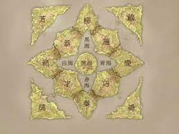

---
aliases:
- 十二国记 第一卷 月之影·影之海 下
authors:
- \[日\] 小野不由美
endTime: "2021-09-17"
startingTime: "2021-09-17"
---

# 十二国记 第一卷 月之影·影之海 下

> 作者: \[日\] 小野不由美

> (2021-09-17 \~ 2021-09-17)

## 目录

## 主旨

## 关键词
, #十二国记 #小夜不由美 #阿德勒 #成长 #勇气 #改变 #责任 #麒麟

## 标记
1. **"你就是你自己的主宰,你了解自己应负的责任.对不了解这一点的人再怎么解释君王的责任也是枉然,一个不能统治自己的人当然无法统治国土."**
4. 即便如此还是要活下去.就算注定没有朋友与立足之地,还是打心底珍惜这条命.要是这个世界全都希望阳子去死,就要活给他们看.要是原本的世界全都不希望阳子回去,就要回去给他们看.
5. "咱没办法眼睁睁看到人被杀." 说着乐俊笑了. "咱可不是那种同情死有余辜的坏蛋的烂好人,咱是看不惯只因为身为海客就该受死罢了."
6. "但我是坏海客吧!" "那是官府才这样想啦!海客之中应该有好也有坏吧?他们只是少见多怪." "他们说坏海客会灭国." "那是迷信."
7. "即便如此,咱仍不算是一个人,永远被当成半个人,因为咱只有一半是人类.**这副模样是出生时就注定的,所以并不是咱的错啊!"**
8. "这是娘为了送咱去上雁国少学才帮咱存的钱.在雁国,半兽也可以读地位最高的大学,可以当一国的大官.他们会承认你是一个完整的人,可以领到田地,户籍里也会登记你是正丁.其实咱心里是想,把你带去之后再拜托对方看看,说不定能在雁国谋个差事."
9. "**君王要制订法律,那叫做地纲.州侯也会订定法律,但不能违背地纲.然而即便是地纲也不能违反施予纲." "施予──什么?" "那是上天授与君王,要他依此治理国家的准则.如果将这个世界比喻为天幕,它就是支撑世界最重要的准绳,因此也叫做天纲或太纲,就算是君王也得遵守.只要不抵触太纲,君王可以任意统治自己的国家.**"
10. "没有错.然后,他分别将树枝交给十二个人.树枝上结了三个果实,缠着一条蛇.这条蛇松开树枝并举起天空,而三个果实则分别掉下来成了**土地,国家和王座,据说树枝则变成了笔.**"
11. "**这条蛇就是太纲,土地就是户籍,国家就是律法,王座就是仁道──也就是宰辅,笔则代表历史.**"
12. "那你们不会祈求考试合格,或是祈求赚大钱吗?" 阳子说完,这回换乐俊吃了一惊. "这种事在于你本人付出多少努力吧?祈求会有用吗?"
13. "乐俊想报案就去报案!" 堆积在胸口的东西终于化成泪水迸出来. "乐俊有这个权利.他想密告我当然可以去!" "天真啊!天真!"
14. "既然你说得这么天真,那迟早会被人家利用." "被出卖也无所谓." "天真哪!" 苍猿格格格的笑声划破黑夜. "你当真吗?真的无所谓吗?被人利用被人耍着玩都无所谓?" "被人出卖也无所谓,那只是让出卖我的变成卑鄙小人,不会损害到我一丝一毫.起码比我去出卖别人,我去变成卑鄙小人要好." "变成卑鄙小人才好啊,因为这里是魔鬼的国度.没有任何人会对你友善,因为这里没有友善的人."
16. 苍猿突然停止了笑声. "你去死吧!无家可归,没人想念,上当受骗,你去死好了." "我不要死." 现在死去的话,她将一直是愚蠢又卑鄙,以死了结就是姑息这样的自己.要烙下生命没有存在价值的烙印很容易,她不许自己这样逃避. "你去死.去饿死,累死,抹脖子死掉." 她鼓起全身的力量将剑一挥.割开了草丛的刀尖划破空气,手上一股很强的劲道传回来.在四散的叶片间,苍猿的头颅弹起来,落地,喷出血水滚动着. "我绝不认输……" 眼泪已停不下来.
17. **"没错.正因为我被追捕,所以现在更要珍惜生命.等我不用担心被追捕,自己的性命完全属于自己时,我再考虑要怎么活下去.要反省,要赎罪,都等那时再来思考."**
18. 阳子在祖国都是察言观色的过日子,没有惹别人讨厌,也没有让别人喜欢.她害怕与人冲突,害怕被骂.如今想想,她觉得自己何必要怕成那样呢? 或许那并不是胆怯,单纯只是懒惰罢了.对阳子来说,与其提出自己的意见,不如附和别人的言语来得轻松;与其坚守己见甚至引发对立,不如暂且配合别人以免引起风波来得轻松;乖巧地配合别人扮演"好孩子",要比追寻自我,与别人奋战地活着轻松多了. 她曾活得卑鄙又懒惰.所以她想再回去一次.回去的话,阳子可以活得和以往截然不同.她想得到努力的机会.
19. "那是咱的自由.咱希望你信任咱,所以你能信任咱就开心,你不信任咱就落寞,这是咱的问题.要不要信任咱则是你的自由,信任咱你也许有好处,也许有坏处,但那是阳子你的问题."
20. 阳子喃喃说道.当她说出"想回去"的那一刹那,突然有种凄凉的感觉. "……祝福你平安见到延王." "至少在走到城门之前,要我说说日本的事吗?" "没有必要." 落人笑了. "**那里是我革命失败所逃离的国家.**"
    * 日本上个世纪60年代的学生运动
21. "君王在登基之前就是凡人.君王不是由出身决定的.说得夸张一点,和一个人本身的个性,外在都没有关系,全凭麒麟是不是选中你,就这么简单."
22. "有啊,天空里的啊!" 听到乐俊这么说,阳子回头. "天空里面有海吗?" "没有海的话,就不能叫云海了呀!"
23. "我不是要说这个,你别急.——如果君王迫害百姓,那百姓要如何得救呢?" "其中一个方法就是叫'民主主义'吧?" 说这句话的是延麒. "由百姓选出合乎自己利益的国君,不合利益的就要他下台." "正是." 延王继续说道. "在这里,用的是更特殊的方法.要是国君迫害人民,只要叫不会迫害百姓的人来当国君就行了.这就要靠麒麟."
24. "成为君王的那一刻就等于死去再重生为神,既然不是君王,也就无法继续活着了."
25. 是先有天命?还是先有选择? 阳子这样问延王. 是阳子背负天命生下来的?亦或是景麒选中她后,她才必须要承担起王位? 不知道.说这句话的是延麒自己. "我才是完全搞不清楚,为什么要选择这个家伙.不过,我就知道是他."
26. 难道它和剑鞘一样吗?阳子心想,和鞘中的苍猿一样难以驾驭. 此外还有个理由,因为阳子抛不下对故国的执着.想通这一点,她没有放弃.

## 笔记

### 理解

* 十二国记全套更多是讲不同人物的成长, 尤其是女性的成长. 第一部是阳子, 第二部是阳子, 大木灵, 祥琼, 第五部是朱晶, 之后番外也是是以女性为主角.
* 第一部中阳子大量的内心独白, 是每个成长期的孩童都会面对的问题, 从社交, 学业, 即将步入大学或社会, 各种问题. 而书中阳子的成长, 对每个人都很有帮助, 虽然在不断犹豫也在不断的向前.
* 看的过程中, 阳子和苍猿, 阳子和乐俊, 阳子和延王, 延麒的对话, 中包含[被讨厌的勇气](./被讨厌的勇气.md)所探讨的内容. 注重当下, 努力做好自己, 不要讨好他人, 也不要忽略他人, 勇于承担责任, 但不要压迫自己.
* 书中一个好玩的描述, 十二国记的世界海客是日本来的, 山客是中国来的, 而海客主要飘到东边三个国家\(庆, 巧, 雁\),  山客会飘到黄海, 那说明十二国可能出在中国和日本之间, 但中国被折叠在黄海之上的这么个位置.

* [图南之翼, 风之万里黎·明之空](../../comics/2017/十二国记.md)
* [十二国记-魔性之子](../2019/十二国记-魔性之子.md)
* [被讨厌的勇气](./被讨厌的勇气.md)
