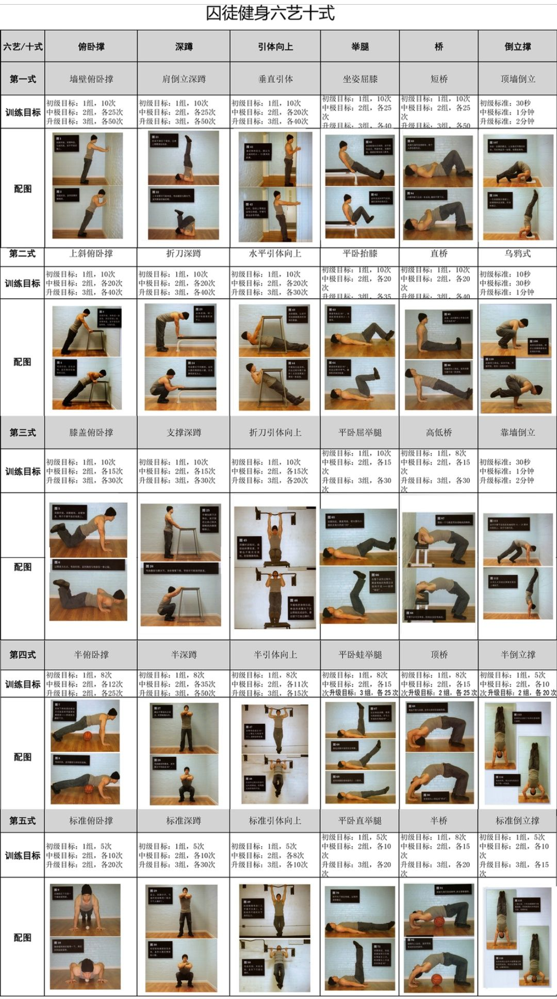
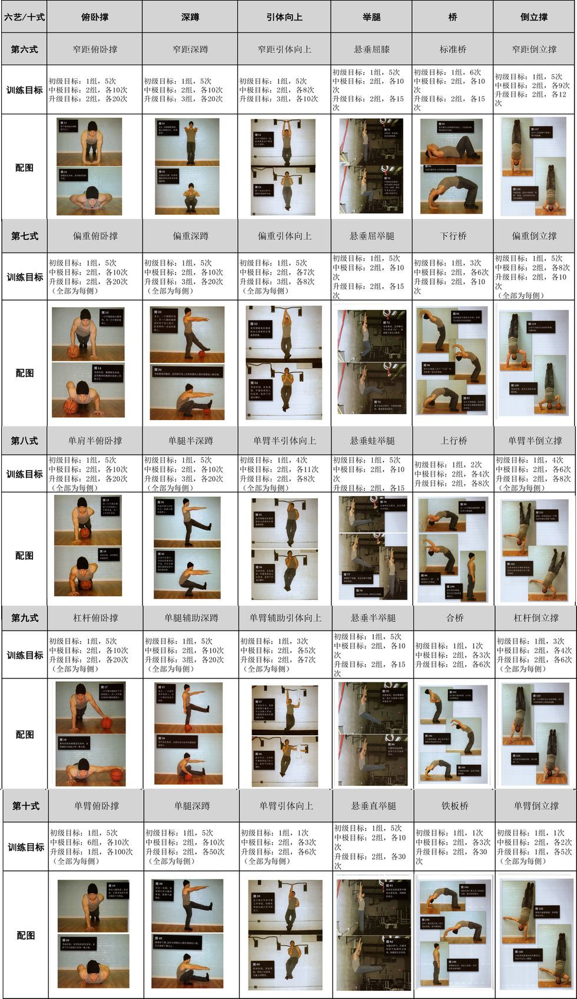

# 囚徒健身

> 作者: 保罗•威德

> (2021-04-22 \~ 2021-04-26)


## 目录
```
第一部分：预备
第一章 力量之旅：启程 3
第二章 失传的技艺：“老派”体操 10
第三章 自身体重锻炼与现代健身方法：囚徒宣言 17
第四章 关于本书：囚徒健身 26
第二部分：六艺
第五章 铠甲般的胸肌与钢铁般的肱三头肌：俯卧撑 35
第六章 升降机般的大腿：深蹲 68
第七章 仓门般的背部与大炮般的肱二头肌：引体向上 104
第八章 魔鬼六块：举腿 138
第九章 严阵以待的脊柱：桥 171
第十章 健康、强力的肩膀：倒立撑 204
第三部分：自我指导
第十一章 金科玉律：身体智慧 241
第十二章 训练计划：日程 255
致谢 264
```

## 主旨

## 关键词
, #健身 #自体健身 #保罗 #威廉 #深蹲 #俯卧撑 #引体 #举腿 #桥 #倒立撑 #平衡 #健康 #运动 #保健 #身体 #体操

## 标记
1. 我也不是什么天才运动员.第一次狱中受伤,发生在我22 岁生日后的第 3 周.当时我体重 68 千克,身高 186 厘米,我的手臂瘦长,看上去就像烟斗通条,甚至还不及通条结实.**有了早些时候的险恶经历,我很快就认识到囚徒们恃强凌弱就像呼吸一样平常,而遭到恐吓更是家常便饭.我不希望自己成为任何人的"婊子".我认识到要想不成为别人的目标,最安全,最有效的方法就是让自己变强,面且要快.**
2. 很走运,进到圣昆汀监狱几周之后,我就被安排与一名前海豹突击队员同在一间囚室.
3. 他受过军事训练,体形健硕.他教我做一些基本的健身动作,如俯卧撑,引体向上,深蹲. 我学到了做这些动作的正确方法,仅仅跟他训练几个月后我的块头就增大了不少.每天在囚室里锻炼,我的体能提升很快,不久之后有些动作便能做上数百个了.
4. 过去很多人都是用自身体重训练来真正强壮体魄的.当然,为了展示力量,他们也要借助外物—如铁桶和钉子,但大多数时候,他们都是通过控制自己的身体来增强自身的力量.事实上,乔憎恨杠铃和哑铃.
5. 如今,体操一词,在健身界已不太常被提及了.体操这个词(calisthenics)直到 19 世纪才开始在英语中出现,它其实源于古老的希腊语"kallos"(意为美)和"sthenos"—— (意为力).
6. 如今,一提到体操,大多数人只会想到反反复复的俯卧撑,仰卧起坐以及难度不大的开合跳,原地踏步等动作.体操已经成了人们健身的次要选择和成本低廉的有氧运动.
8. **通过体操锻炼,人的身体不会像今天众多健美者的那样丑陋肿胀,而会呈现完美的比例,看起来自然而和谐.想要达到这种和谐状态并不难,因为体重本身就是一种阻力,这种力不大亦不小,正是大自然的完美阻力:古希腊人知道,体操不仅能增强人的身体力量和运动能力,也会使我们的动作更优雅,身材更优美.因此,体操一词在希腊语中是"美"与"力"的结合.**
9. 你需要的是可以让你抓住,能让你吊在空中的东西,随便看看就能找到它们——门,管道,甚至是树权.你根本不需要去健身房,即使在家中锻炼你需要的空间也不会很大——只要有一块与你的身体同样大小(有时甚至更小)的地方就足够了.
10. 运动学家可能会说,体操动作比举重技巧更"本真".当你移动自己的身体时,比如做引体向上或深蹲时,你的肌肉和骨骼会自发地调整为最有效,最自然的运动方式.相反,举重时你的身体不得不尽可能不自然地移动,从而最大限度地锻炼相应部位的肌肉.
11. 实际上真正好的健身计划只需要一些基本动作.这是因为尽管人体有五百多块肌肉,但这些肌肉都是要与其他肌肉共同工作的.尝试孤立地锻炼肌肉的人往往会忽略这一事实,并逐渐削弱身体作为协调的整体来运作的自然本能.
12. 一个动作反复做很多次没什么不好.但正如第二章所讲的,你在做俯卧撑或引体向上时,若只是增加动作的次数,那么只能增强你的耐力,对增强你的身体力量和打造肌肉没什么效果.
13. 我把六艺中的每一艺都细分为十个级别.
14. **俯卧撑是最好的上身练习动作,它既可以增强我们的身体力量,打造出结实的肌肉,形成强有力的肌腔,又可以让上身的推力肌肉与腹部,下背部及下身协调工作.**
15. 俯卧撑尤其锻炼胸大肌,三角肌前束和胸小肌,从而最大限度地发展你躯干上的推力肌肉
16. 得到静力锻炼的肌肉包括背阔肌,胸腔中所有的深层肌肉,脊椎肌肉,腹肌,腰部与髋部的肌肉,臀肌,股四头肌,胫骨前肌,甚至连你的双脚与脚趾也会受益.
17. 每隔几周变换花样做几组快速练习,对运动能力有好处.尽管如此,最主要的俯卧撑练习还是应该做得慢一些,经 2 秒降到最低点,坚持 1 秒,再用 2 秒回到最高点,之后立即降低身体.
18. 为什么应该以这样的速度做俯卧撑呢?原因有二:第一,平缓的动作能够练就更高水平的纯粹力量.当你做爆发式运动时,这一动作的某些部分不可避免地要依赖惯性,惯性发挥作用就意味着你的肌肉没有发挥作用.
19. 大多数人做单臂俯卧撑都会感到吃力,他们会发现很难在身体降到最低点之后再把自己推起来.这是因为此时肘部的弯曲程度最大,而肘部的弯曲角度超过直角时胳膊就很难使上力气.
20. 姿势正确的单臂俯卧撑是检验胸部与肘部力量的黄金标准,而且能够让人一见难忘.
21. 做宽距俯卧撑时你不是让双手相触,而是让双手之间的距离比做标准俯卧撑时的更宽,达到肩宽的两倍.这个变式减轻了肱三头肌和肘关节的压力,但是给胸肌造成了更大压力(就在胸肌接触肩部的那一点上).
22. 有些人不相信一个简单的动作就可以锻炼整个下半身,但深蹲在这一点上当之无愧.
23. 这个动作究竟是什么样的呢?深蹲是指通过弯曲下身的三个重要关节(即髋部,膝盖,脚踩)而放低身体.
24. 你要认识到,双肩收紧在任何悬垂练习中都对保护肩部有重要意义.
25. 肩关节是球窝关节,这种关节的运动极其灵活,但其代价就是极易受伤.双手抓握横杆,身体悬于空中时,如果肩部放松,球窝关节就会被完全拉伸,只靠弹性不足的韧带维系稳定.
26. 19 世纪之前,很多牢房基本上就是一个笼子,美国的监狱尤其如此,所以牢房顶部都有横杆.19 世纪的囚徒不出牢房就可以做引体向上,但是这些横杆使囚徒的自杀率大幅增加,因而逐渐被淘汰.
27. 由于该动作强度较小,可以使初尝拉力训练的人,在进人难度更大的动作之前真切地感受肩部和上背部肌肉的"发力"
28. 弯曲肘部,夹起肩部,直至下巴超过横杆.这是该动作的结束姿势(图 50).欣赏一下上面的风景吧!暂停一会,然后有控制地反向运动.不要做爆发式动作,否则惯性就会参与进来.
29. 背部的肌肉量虽然不如腿部,但却是人体中最复杂的部位.我们通常将背部分为四个区域:脊柱(竖脊肌,腰肌),背阔肌,上背部(菱形肌,大圆肌与小圆肌,肩脚骨周围的斜方肌,三角肌后束等),斜方肌上段(颈部与肩部的大肌肉群).当你练习引体向上和桥时,所有这些肌肉(及其周围的更多肌肉)都能得到最大的刺激,无需再进行其他的练习.但是,如果你偶尔想换换花样,增加新的背部练习动作或是你正处于伤病恢复期,那以下变式也是不错的选择.
30. 魔鬼六块包括: 强大得不可思议的身体中段,腰部附近的所有肌肉(腹外斜肌,腹横肌,腰肌,肋间肌,前锯肌)都受过高度训练,着实能提升整个身体的实力.
31. 超级级实用和灵活的腰部和髋部——不仅能增强脊柱的力量,也会给跳跃,踢腿,攀爬或其他任何体操与体育活动提供不可思议的爆发力.
32. 厚实而坚硬的腹部,可以抵挡他人的攻击——攻击者甚至会因此而受伤
33. 精瘦的肌肉系统能够完美地支撑内脏,甚至连呼吸与消化等重要的身体功能也会变得更有效和健康. 厚实的,令人畏惧的腹部,看上去像一块块砖头,而非那些肌肉模特的"可爱腹取".
34. 深蹲打造强有力的双腿,俯卧撑发展胸肌,引体向上练就厚实的背阔肌和肱二头肌.还有太多太多的练习能铸就令人钦佩的大块肌肉,只要你知道如何正确做它们.数以百计肤浅花哨的健身书都在教人们如何练出可以卖弄的大块头,但桥这一能把脊椎练得如钢鞭般强健而又灵活的技艺,却几乎不为人知.
35. **事实上,脊椎肌肉是身体上最重要的随意肌,没有之一.**
36. 它包在柔韧且呈铰链式连接的,厚厚的装甲里,这种装甲由坚韧的软骨连接着诸多密实的单个骨头组成,这些单个骨头就是脊椎骨,这些软骨就是推间盘.整个脊椎又进一步由韧带与控制脊椎运动的深层复杂肌肉组成的网络保护.共有 30 多对基本的脊椎肌肉,由于篇幅所限,此处并)帛罕细罗列,也不具体描述它们各自的功能.
37. 它包在柔韧且呈铰链式连接的,厚厚的装甲里,这种装甲由坚韧的软骨连接着诸多密实的单个骨头组成,这些单个骨头就是脊椎骨,这些软骨就是推间盘.整个脊椎又进一步由韧带与控制脊椎运动的深层复杂肌肉组成的网络保护.共有 30 多对基本的脊椎肌肉,由于篇幅所限,此处并)帛罕细罗列,也不具体描述它们各自的功能.感兴趣的训练者可以拜读亨利·格雷(Henry Gray)的<格雷解剖学>(Gray'sAnatomy)
38. 所有这些肌肉都不是各自为战,而是被塑造成了两根厚实的,强有力的,蛇一样的管子,附在脊柱两侧,这些肌肉群叫做竖脊肌.
39. **脊柱下部(腰椎)受伤,双腿将失去知觉,伤者将大小便失禁和性无望. 脊柱中部(胸椎)受伤,伤者无法控制躯干的肌肉. 脊柱上部三分之一(颈椎)受伤,会使手臂,肩部和颈部瘫痪.如果伤势严重.那么为肺部提供动力的隔肌也会瘫痪**
40. 除以上这些症状以外,脊柱受伤还有可能引发其他可怕的副作用,包括肌肉萎缩,骨质疏松症,神经性头痛,以及基本生理功能(如血压,体温和心率)的失控.更糟糕的是,脊髓神经组织复杂得不可思议,一旦受损其自我修复能力微乎其微.
41. 今天,普通人的生活中都存在对脊柱弃之不用或用之不当的问题.人们一整天弯腰坐在电脑屏幕前做重复的工作,这种糟糕的姿势让脊椎骨处于不健康的状态,回到家后他们又会瘫倒在沙发里看电视.结果就是现代的文明人遭受越来越多的背部问题,甚至在三十多岁时,有些人的椎间盘就开始退化了.
42. **长期练习桥,你的骨头甚至会变得更强壮.椎间盘由软骨组成,但凡是软骨其中都很少有血流——它们只能从关节内的液体(滑液)中获得营养.由于滑液并不与血液循环相连,所以只有当关节来回运动时,关节内才会有新鲜的膺垠.桥会移除废物,给椎间盘带来营养丰富的滑液,从而使其康复并阻止其退化,确保其处于最佳的健康状态.强壮的脊椎肌肉可以减少椎间盘突出的概率,甚至有助于治疗椎间盘突出.**
43. 1.脊柱应该形成凹面,背部必须形成优美的弧形.说来简单,但如果脊柱的深层肌肉很弱,那么训练者就倾向于使用四肢撑起身体,这样背部会显得很直挺.
44. 2.背部应该远离地面.屏弱的桥最明显标志就是髋部只能勉强离地;完美的桥,髋部与臀部应该比头部和肩脚骨要高.这点很难判断,除非你从侧面给自己拍一张照片.
45. 3.双臂与双腿应该伸直.做桥时,双臂伸直相对容易,但要双腿与其同时伸直,则需要训练者具有非常好的柔韧性. 4.呼吸应该又深又平缓.桥使胸腔伸展,使 MA 受到压力,如果胸部僵硬,那训练者的呼吸会急促不平.自然的呼吸是掌握桥的标志.切记,练习时绝不要屏住呼吸.
46. **不要因为桥是如此重要的动作,就贸然开始练习.在你的身体还未习惯的情况下,做桥是很危险的.极少训练者有足够的脊椎力量,以至于一开始就能做出桥.更糟糕的是,一般人身体的柔韧性完全是不平衡的:大多数人都习惯于前倾,**
47. 如果仅仅是一时兴起就开始练习桥,那么缺乏力量的肌肉和不平衡的柔韧性会让你的肌肉拉伤,甚至更严重. 你需要计划.如果你刚刚接触桥(或只是大概练练),我建议多花点儿时间去锻炼基本力量.大量的深蹲和举腿会增强你的背部与髋部肌肉,并让腰部更加灵活.等到你掌握了窄距深蹲(86 一 87 页)和悬垂屈膝(154 一 155 页),你就可以着手应付桥系列了.
48. 如果你通过举腿和深蹲系列培养了一定的力量基础,那么练习桥系列的前三式应该问题不大.即使这样也不要急于求成,要培养而不要破坏训练的势头.你不妨在桥系列中多花些时间,毕竟我们的脊柱极为珍贵,值得善待.
49. 其余四式将教你做桥的高级手法,直到最终能做铁板桥.铁板桥的动作是从直立姿势弯身成桥,再平缓地进行反向动作,并最终回到直立姿势.
50. 下面是桥系列十式的详细解说,读读看吧.但要记住,如果你做不到深蹲和举腿系列的第六式,最好不要尝试这个系列.
51. 如果你的后背足够柔韧以维持高度的弓形,腹部又足够有力,在你起身时手指会离地(图 105).这个向上的运动过程应该是平缓向前转移体重的结果,而非用双手以爆发力推地面的结果.
52. 首先,肩袖不是一块肌肉,而是一个肌肉群,其作用是将肪骨(即 上臂骨)稳定在肩关节窝中.详细来说,肩袖包括四块肌肉(冈上肌,小圆肌,冈下肌,肩胛下肌),它们控制上肢向前,向后旋转.(而三角肌是肩膀处的大肌肉,负责手臂的主要运动,通常与背阔肌侧面,大圆肌和斜方肌背部,胸肌胸部协同工作,可以使手臂向下,向后,向前以及向上运动.) 这
53. 第二部分介绍的关于"老派"体操技巧的方方面面,足以使你受用终生.但高效的训练不仅仅是正确地完成这些动作——不管这些动作本身多么有效. 在监狱里你只能依靠自己,因此你要学会指导自己.
54. 这就是成功训练的"未知因素".这是一种对核心要素的领会,它潜藏在所有的健身经验之中,比如知道如何完美热身,如何达到理想的训练节奏,**应该怎样艰苦地施行训练,以及应该在何时"松口气"等等.**
55. 这些未知因素从来都不是非黑即白,因而其更像艺术,而不像科学.你不可能把这些东西写在纸上,并交给一个训练者.因为它们并不是简简单单的条目式的知识,而是一个训练者在经验中获得的内在的领悟.这更多的是"身体智慧",而非死记硬背.
56. **体温升高后肌肉细胞就会变得富有弹性,易弯曲,这就是为什么所有明智的训练者都会在训练前热身的原因.热身不仅可以减少训练者受伤的危险,也可以让神经系统做好运动准备,使具有润滑功能的新鲜的滑液充满关节处,以迎接难度更大的动作.**
57. 最有效的热身方式就是要练习什么动作,就以此动作的低难度版热身,做上 2-4 组高次数的,难度递增的练习.如果你很年轻关节又没有问题,那只需做 2 组热身;如果你年龄偏大,身体状况不好或是天气寒冷,那就做 3 组,甚至 4 组;超过 4组,只是白费力气而已.
59. 最好的办法就是,热身时先做一组 20 次的练习,然后再来一组 15 次的练习,之后就可以开始正式锻炼了.热身时不要太卖力,两组练习中只要用一半的力量即可.换句话说,第一组热身要选择一项你至少能完成 40 次反复的动作,第二组热身要选择一项你至少能完成 30 次反复的动作.第二组动作的难度要高一些,因为次数降低了.第一组热身使你打算锻炼的肌肉充血,第二组热身时这些肌肉已经开始使劲并燃烧起来.两组热身之后,你应该感觉很兴奋,准备做更刺激的锻炼——而不是精疲力竭,想要休息.
60. 我总是建议新手:不管你多强,都要从第一个动作开始.没错,六艺中每个单独的系列,都应该从第一式开始.切勿直接跳到第三,第四,第五式甚至是第六式.一定要从最简单的动作开始,然后逐渐增加强度.给自己留出至少四周的时间,然后再全力以赴地锻炼—或许两个月,直到你快要开始厌烦为止.
61. **从长远来看,从零点起步更有益处.这不仅可以强化你的关节,重启你的神经系统,提高你的协调能力,平衡能力,反应能力和节奏感,还能更好地发展你的核心区力量,激发你挑战更难动作的动力.**
62. 每个人的情况不同,而且一般说来,在十式中达到升级标准所需的时间会越来越长.你越强壮,就越难变得更强壮,这一点人人平等.
63. **聪明的举重教练会对毛躁的年轻选手说这样一句老话:"杠铃又不会跑掉."不要执著于数字,你的身体并不理解数字,也不在乎你做的动作是不是更高级,更酷,你的身体只理解你的努力.**
64. 由于还没有让身体花时间培养所需的能量,所以他的身体开始出现颤抖和拉伤,但他仍然坚持每周冲刺更多的次数,虽然姿势己经越来越不标准了.
65. 当他感到自己好像不能再完成一次标准的动作时,便就此罢手——不为了凑数随便做动作,而是把下一次的完美动作"存下来",一周甚至两周之后再兑现.你猜怎样?他做到了.
66. 这才是真正持久受益的训练法.忘掉那些向你保证一夜就增加块头与力量的书吧!那些都是镜花水月,只会让你走向失败与沮丧.
67. **对我的所有学生,我都建议 2 秒下,2 秒上,在结束姿势中暂停 1 秒的练习节奏.你应该在所有系列中保持这一速度,至少到第五式**
68. 首先,这样有助于保护关节,培养健康的软组织——只有强壮的关节才能更好地应付爆发式的动作.其次,这有助于培养训练者的控制力,协调性,还有强力的身心连接.再次,慢动作有助于你更快地变强变大,因为没有惯性捣乱,压力会完全地施加在肌肉和关节上,这会强迫它们不断发展. 最后,慢动作会使那些看起来很轻松的动作变得很难.
69. 但是,你无需永远保持这个节奏.如果你是一步步锻炼过来的,那么在第五式之后把动作做得快一点儿也不错.事实证明,在最后的几式中,要完美地保持这一节奏也几乎不再可能.
70. 将注意力集中到你所能做的难度最高的动作上,但是如果你的动作开始走形,就应该立即结束该组练习
71. 在体操训练中,练到彻底"力竭"并不是好主意,你应该让肢休保留一定的能量,以能控制自己的身体.练到力竭特别不安全,尤其是在倒立动作(如倒立撑)和悬垂动作(如举腿和引体向上)中.
73. **生病了仍然努力训练会使你的免疫力下降,并有可能拖延病情.**如果你觉得并无大碍还可以训练,那就练些低难度的动作(根据具体情况自己判断).如果你有小伤或是刚刚受伤,那你总是可以继续训练——而且在大多数情况下你应该继续训练,从而把更多血液带到受伤部位,治愈伤痛—这本身就是一门艺术.
74. 虽然以前都做得不错,但有时候他就是不能从一式跳到下一式.如果你也遇到了这样的问题,下面的四个方法会帮你渡过难关: 1.降低体重
75. 如果你发现自己停滞不前,很难进步,那可以集中几个月内甩掉赘肉.
76. 2.多休息.干劲与刻苦都值得赞美,但是如果让身体超负荷工作,那就是自讨苦吃.
77. 3.有耐心.这是一个常见问题,经常有训练者迷恋于进度,逼迫自己每次训练都增加很多次反复,以期迅速升级.
78. 4.**干净地生活.帮助自己身体适应,发展的方式之一,就是正确对待它:让它睡足觉,别给它灌酒精和毒品,别让它透支,尊重它.**
79. 巩固训练是处理这种状况的好办法.不是一周锻炼一两次,每次都努力增加次数,而是尝试每天都练习这个新动作,有时甚至是一天练习两三回.放松,然后每回不是尽可能做更多次,而是最多只做一两次.
80. 有人告诉我说这是因为相比于一次长时锻炼,多次的短时锻炼可以更有效地"教"神经系统处理相应的动作技巧.不要在那些你已经能做多次反复的动作上使用巩固训练,只有在升级到新的,让你真正遇到挑战的高级技巧时才使用它
81. 多少锻炼组为好? 只要不是热身组,只要是你需要奋力才能完成目标次数(保证姿势标准)的练习组,都是锻炼组.
82. 一个很好的判断方法是,当你的动作开始严重走形时,就结束这一组练习.如果你感觉需要突破这一点,那应该减小动作幅度,或者短暂休息一下,再做几次高质量的,姿势完美的动作;也可以只练习反向阶段(即从结束姿势回到起始姿势的阶段)的动作,但这应该是高级训练者在特定条件下才可以考虑的.
83. 将生命中重要的事情记录下来,这是人类的天性.记下自己的努力与成就,本身就是很有益的活动.训练日记会见证你的成长,在几年之后再翻看时,更会让你倍感欣慰.
84. 在监狱里,你会学到所谓的规矩.吃饭,睡觉,放风,接受探视,干活都有规定的时间. 每件事情都是按照时钟来,很少有你做主的余地.有人将其称之为"靠警报生活",因为一天中特定时段的开始和结束,都会伴随着警报声.
85. 用不了多久你的身心就会适应这种程序——这就是老囚徒都变得非常"体制化"的原因之一.如果出狱,没有了时间表,没有人告诉他们什么时间做什么,他们会非常,非常失落.其中聪明的家伙都会自创时间表并长期坚持,这帮助很多人活下来,并防止他们再出现犯罪行为.
86. 监狱里最成功的训练者都发展出了自己的时间表.他们不是在想锻炼的时候锻炼,也不是在烦闷或孤独时锻炼,根本不是.他们会先看一下监狱的时间表,然后在其中有目的地插人训练时间—这样做会让我们在一个自己几乎无能为力的世界里体会到一点儿控制感,同时也能给我们一些属于自己的东西,一些可以期望的东西.
87. 训练目标也许是决定训练长短以及频率的最主要因素.持续时间很久的大运动量训练,会造就体力和耐力,但不会打造肌肉和力量.
88. 力量是我现在训练的动机,这也是我一般不赞成长时间训练的原因.我建议先好好热身(参见第 241 一 243 页的内容),然后做二~三个锻炼组,这时要在每个单项练习中都全力以赴.
89. 一旦你真正付出全力,再多做一点儿就只会损害身体的恢复能力,让你更长时间地感到酸痛,这又意味着你必须等更长时间,才能重新练这个动作.
90. 我制订了五个基本训练计划.第一个是"初试身手",一周训练两次,对初学者比较理想.第二个是"渐入佳境",一周训练三次,几乎能帮助任何人实际地获得力量和肌肉.第三个是"炉火纯青",每周训练六次,非常适合那些体能不错的人.第四个称为"闭关修炼",只适合恢复能力特别好的高级训练者.最后一个计划是"登峰造极",是为专攻耐力而非力量的精英训练者设计的.
91. 本章一开始,我就谈到规律训练的巨大好处.但是,计划应该是为使用计划的人服务的. 如果颠倒过来,把计划放在人之上,可就大错特错了.
92. **我在很多人身上浪费了大把大把的时间,我甚至希望从没遇见过其中的某些人. 但锻炼呢?我花在上面的每一秒钟我都不后悔. 每一刻的努力,每一滴的汗水,都值得.**


## 笔记

### 理解
* 健身很重要, 要多运动.
* 作者强烈抵制健身房健身, 当然两种方式并没有什么好坏, 选择合适的很重要.
* 专业或职业看着没啥用, 业余为了健康可能看这个更合适一些. 自体健身不需要复杂的器械和大场地就可以完成.

## 六艺

[视频集合](https://www.bilibili.com/video/BV15s411i75a/)



