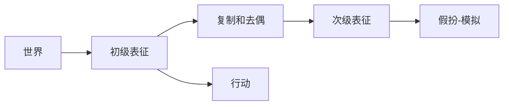
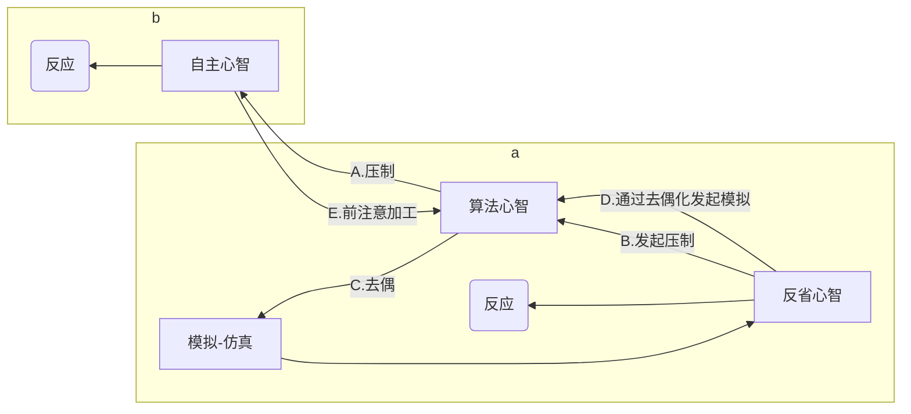
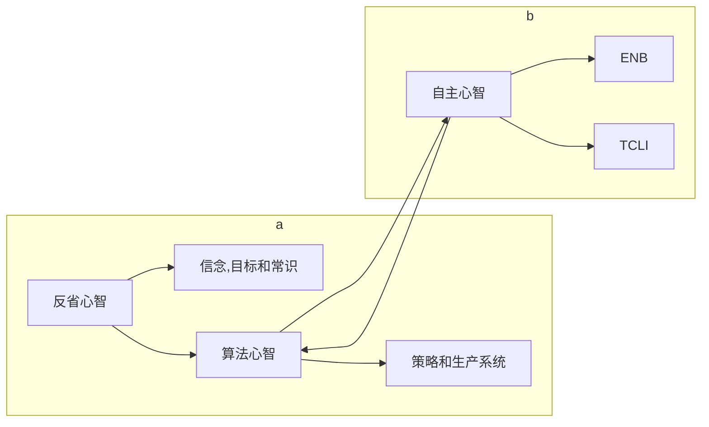

# 超越智商

## 目录
```
导读 理性：重新定义人类认知能力
译者序
序言
致谢
第一部分 理性之心
    第1章 乔治·布什的心智：有关智力测验缺失什么的线索
        这本书不谈什么
        困惑于布什智力的缘由
    第2章 理性障碍：理性与智力的分离
        如何描述这类案例
        广义与狭义智力之争
        理性：缺失的元素
        将理性障碍用作直觉泵
    第3章 反省心智、算法心智与自主心智
        类型一与类型二加工
        临时的“双重加工”心智模型及个体差异
        思维倾向与认知能力
        三重加工心智模型
        思维倾向：理性思维和行为的预测源
        别忘了心智程序！
        走近总统先生的大脑
    第4章 给智力概念瘦身
        智力霸权主义
        另辟蹊径：用理性障碍驯服智力概念
        MAMBIT：没有司机的大脑引擎
        智力被误读为适应
        神化智力概念的阴暗面
        民间心理学能够区分智力与理性
    第5章 为何聪明人常做蠢事
        人类是认知吝啬鬼
        我们为何成了认知吝啬鬼
        为什么理性障碍如此普遍
        思维谬误和理性思维
第二部分 人人都是认知吝啬鬼
    第6章 认知吝啬鬼
        属性替换：认知吝啬鬼的惯用伎俩
        认知吝啬鬼的工具：生动、出众与可得性
        启发式加工：决策过程的量与质
        认知捷径和个人自主性
        现状偏见：默认启发式加工
        启发式加工的有利和不利环境
    第7章 决策效应与认知吝啬鬼
        框架与个人自主性
        翻手是云，覆手是风：框架效应研究
        机会均等框架
    第8章 我方立场信息加工：正反都是我赢
        过度自信：关于我们知道的那些原本不知道的事情
        我方立场信息加工：沟通与知识假设中的利己主义
        智力与我方立场信息加工
    第9章 认知吝啬鬼的另一个缺陷：深思熟虑后依然战败
        电车难题：压制情绪
        战败“冷”启发式思维倾向
        本能冲动与意志力：深思熟虑后的失败
第三部分 给大脑安装好的心智程序
    第10章 心智程序缺陷
        现实生活中的心智程序问题：心智程序缺陷效应引发的两起悲剧
        贝叶斯前来救援！
        一个关键的心智程序缺陷：忽略备择假设
        更多的科学思维心智程序：可证伪性
        基础概率：更多贝叶斯心智程序
        概率评估的心智程序
        策略性心智程序
        心智程序缺陷导致的理性障碍
    第11章 污化的心智程序
        “如果一个人有两个大脑，他会加倍愚蠢”
        对污化心智程序的质疑
        人们为什么会受污化心智程序的影响
        破坏协议的模因
        避免污化心智程序的策略
        污化心智程序导致的理性障碍
    第12章 思维谬误何其多：非理性思维倾向分类及其与智力的关系
        带有焦点偏差的连续性联结认知
        理性思维问题的预分类
        由多因素共同决定的理性思维谬误
        斯波克先生难题：来自自主心智的输入缺失
        基于智商-理性相关度的分类
        结论：理性障碍无处不在
第四部分 提高人类理性的社会意义
    第13章 增加人类理性及改善非理性的社会效益
        好消息：理性是可以习得的
        改变环境以帮助认知吝啬鬼
        社会选择机制
参考文献
```

## 主旨
[[对伪心理学说不]] 作者的一部作品, 这部作品主要分析了 MAMBIT(智力测试) 并不能代表一个人是理性的, 智商仅仅是心智的一个指标并不是全部, 甚至不是最重要的指标.
人的理性时刻收到挑战, 人脑有大量的"缺陷"会影响到理性思考, 各种思维谬误并不会因为智商高就可以规避.

## 标记
1. 高考就是考砸了，也无损你在人生大道上前行。我在人生跑道旁，为你们鼓掌、加油。by魏坤琳，一个曾经的高考失败者。 大家都笑了。国人心目中的最强大脑科学男神怎么能算是一名高考失败者呢？当我们长大后，越来越清晰地意识到，智力测验成绩及高考成绩的好坏跟一个人的成功关系不大。甚至，我们可以看到大量反面例子，高考状元，一事无成；聪明人，碌碌无为。所以民间才有了所谓的“聪明人做傻事”的说法。
2. **斯坦诺维奇敏锐地注意到这一点，既然“聪明人”会做“傻事”，那么就意味着认知科学对“聪明”的界定出了问题**。因此，早在1989年，他参照学习障碍（那些智力测验正常，却学习成绩低下的人）的概念，发明了一个新的词汇：**理性障碍**（dysrationalia），用于描述那类智力测验正常，但思维能力低于人类正常水准的人群。正如书中所写： **什么是理性障碍？布什的认知缺陷没有影响到他在智力测验上的表现，但是削弱了他做出理性决策的能力**。这些认知缺陷，是“理性障碍”（类比“阅读障碍”（dyslexia））的根源。我于20世纪90年代创造了这个词，用以引起人们关注智力测验的不足之处。我把理性障碍定义为，尽管具有足够智力，却缺乏理性思考和行动的能力。因此，总统并非不聪明，而是很可能患有理性障碍。
3. 正如卡尼曼上文中提及的肯定被人忽略的要点：“**他们现在更喜欢将其称为第1类型过程和第2类型过程。**”近些年来，**斯坦诺维奇与埃文斯等合作的论文，否定了通过卡尼曼畅销书《思考，快与慢》的宣传而广为人知的“双系统理论”，而更倾向于使用“双过程理论”（dual-process）描述人类大脑工作的两种不同进程**。为什么要否定自己提出的双系统呢？因为系统1、系统2的区分，容易使读者造成一个错觉，以为人们的大脑真的存在两种不同的生理区域。然而，它们仅仅是加工机制而已，所以斯坦诺维奇现在更倾向于使用进程1（Type 1Process）、进程2（Type 2Process）来描述我们人类大脑存在的两个进程：快与慢。
    - 这里一类型和二类型可以理解成 [[思考快与慢]] 中的"快"和"慢"
4. 斯坦诺维奇提出的人类心智的“三重心智模型”。
    1. **自主心智** 正如前文所述，我们知道可以将人类的心智区分为进程1、进程2两种。**斯坦诺维奇将进程1称为自主心智（autonomous mind），自主心智是我们通过进化与内隐学习习得**。比如，我们看到蛇就会害怕，不同民族不同文化对女性的择偶偏好存在一致规律，这都是因为我们虽然生活在互联网时代，但我们的大脑来自石器时代。 除了来自进化习得的适应性组块，自主心智还包括情感化反应、学习习得的自动化反应与条件化反应等。**举个例子，一旦学会骑自行车，就终身难忘，变为本能，这就是后天习得的自动化反应**。
    2. **算法心智** **进程2是传统智力研究重心。它与进程1最大的区别是需要工作记忆介入**。什么是工作记忆？你可以将人类大脑想象为一个简化的输入输出装置。制约这个装置输入输出速率的是工作记忆，它是人类所有能力，包括阅读速度、记忆、注意、执行功能的瓶颈。这个瓶颈受制于人类进化早期出现的前额皮层。**因为工作记忆的瓶颈，导致进程2是个“慢慢想，仔细计算”的过程**。 在智力研究领域，目前集大成的是1997年诞生、影响至今的CHC理论，强调一般智力（G因素）的重要性，将人的智力分为流体智力与晶体智力两种。流体智力更多受制于先天习得因素，包括记忆、处理速度、逻辑推理等核心能力；晶体智力则来自后天习得，如语言能力。其中最核心的智力元素是一般流体智力，也就是智力研究者常常称呼的大G。斯坦诺维奇将传统智力，尤其是与一般流体智力相关的认知操作过程定义为算法心智：“维持认知去耦化是流体智力的重要机制。” 试看一位女士不幸死亡的例子： 场景1：一位女性沿着海边悬崖散步，她试图爬上一块巨石，然而她所爬的并不是石头，而是一道深渊的边缘，她不小心跌落巨石而死。 这位女士不幸死亡，在认知科学家看来，是由于她的算法心智出问题了，计算失误。
    3. **反省心智** 然而，问题来了。进程2仅仅包括流体智力与晶体智力吗？答案是，否。基于上述例子，继续来看： 场景2：一位女士试图自杀，飞身跃下海边悬崖，撞到海边巨石而死。 显然，在场景2中，这位女士的算法心智工作正常，她准确地知道自己跟悬崖的关系，也准确地知道自己行为的后果，那么，她为什么还会做这类非理性行为呢？我们不得而知。既然聪明人会做傻事，那么就意味着我们需要进一步厘清进程2，需要将理性从进程2中剥离出来，独立于传统意义上的智力
5. 斯坦诺维奇重新定义人类的认知能力，将其分成自主心智、算法心智与反省心智三种。这就是斯坦诺维奇的三重心智模型。其中：
    1. 自主心智来自进程1，同时受到进化与内隐学习影响，比如看到蛇就会害怕，或者学会骑自行车后不再需要思考。
    2. 算法心智与反省心智来自进程2。算法心智就是传统意义上智力测验考察的能力，比如记忆、处理速度、逻辑推理等。
    3. 反省心智主要指对人类心智过程进行监控，帮助执行决策与判断，如行为经济学关心的非理性偏差等。
6. 流体理性与晶体理性 那么，理性是否可以习得？ 斯坦诺维奇的答案坚定不移：理性可以习得，甚至比智力更容易习得。 **仿照智力领域的CHC理论，既然我们可以将人的智力分成流体智力与晶体智力两种，那么同样地，我们可以将人的理性分为流体理性（fluid rationality）与晶体理性（crystallized rationality）两种**。
    1. 其中流体理性指更多人类大脑早期习得的模式，比如人人都是认知吝啬鬼；晶体理性更多关乎后天习得的能够增进理性的知识，比如概率知识会有助于增进我们的理性。**斯坦诺维奇整理了人类最重要的13个流体理性**，具体如下。
        1. ①认知吝啬鬼；
        2. ②避免自我中心偏见与准确的自我评估；
        3. ③决策时缺少上下文（框架效应与锚定效应）；
        4. ④信念灵活性：积极的开放性思维；
        5. ⑤信仰理性与真理；
        6. ⑥倾向于寻求信息、享受思考与充分处理信息；
        7. ⑦客观的推理风格；
        8. ⑧对矛盾的敏感：倾向于寻求信念与判断之间的一致性；
        9. ⑨自我效能感；
        10. ⑩审慎贴现未来（双曲线贴现）；
        11. ⑪自我控制的技能；
        12. ⑫良好控制情绪调节；
        13. ⑬情绪调节对奖励。既然我们的大脑会安装各种各样的心智程序，那么，有好的心智程序，也有坏的心智程序。
    2. **斯坦诺维奇将能够促进人类理性的称为晶体理性促进剂**（crystallized facilitators），主要包括5大类知识：
        1. ①概率推理，如明白基线概率；
        2. ②决策科学知识，如明白决策偏好；
        3. ③科学推理知识，如明白自变量、因变量与控制变量，会区分相关与因果的不同等；
        4. ④逻辑的一致性与有效性的规则，如明白证伪、证据的不同层级、个人经验作为证据的不足等；
        5. ⑤经济思维，如明白什么是机会成本、沉没成本，什么是指数增长。
        6. ⑥屡教不改的反思（过度自信自己的反思能力）；
        7. ⑦个人信念功能失调；
        8. ⑧自我鼓励自我中心。
7. 怎样才能避免大脑中被安装上这些坏的心智程序，斯坦诺维奇认为我们需要遵从以下几个规则。
    1. （1）避免安装可能对你（宿主）产生生理伤害的心智程序，比如自残； 
    2. （2）关注影响你目标的心智程序，确保它不妨碍目标选择的多样性，比如让你只相信它的思想；
    3. （3）关注同认识世界相关的信念和模型，努力只安装正确的心智程序，也就是真实反映世界的心智程序，比如不选择过激的价值观；
    4. （4）**避免拒绝对自身进行评估的心智程序，比如神秘主义色彩的思想**
8. 斯坦诺维奇将人类对理性的认识提高到一个新的水准。甚至不夸张地说，他的理性三部曲著作秒杀其他一切行为经济学著作，**将传统行为经济学辐射的50来种认知偏差，重新归类、编织为三类**，用来指涉人们的理性思维水准高下，从而为我们提高理性提供了一条清晰可循的路径。
9. **当你的能力提高了一倍，那时如果你不具备理性思维，你犯错的概率也将伴随增加，给人类造成的社会危害也越大。正如常常为纳粹辩护、高呼希特勒万岁的海德格尔，他是举世闻名的思想家；又如精通文字的著名诗人庞德，在第二次世界大战期间专注于通过意大利广播为法西斯宣传；第二次世界大战后纽伦堡大审判，绝大多数纳粹战犯的智商高于125分，最终策划大屠杀的14人中，有8人拥有博士学位。**
    - 这里的问题, 支持法西斯不一定是不理性的, 反而很可能是理性选择, 可能是被迫选择(不表态可能就要死)或者是主动选择了利益.
10. 卡尼曼和特沃斯基等人研究了人类的基本认知结构为何会让人容易在判断和决策上面犯错误。不过，容易犯错并不意味着一定会犯错。每个人都可以压制自己犯推理错误的倾向，做出理性行为，人们并非一定会深陷于犯错的泥潭无法自拔。更为重要的是，个人判断和决策的错误倾向其实是存在系统化差异的。我的研究团队就致力于探索能够预测个体差异的诸多因素。
11. 在本书中，我将重点讨论智力测验中是否应该同时测量理性。判断和决策技巧，即理性思维能力，其重要性至少与智力测验所评估的那些认知属性不相上下。与智力相似，理性思维技能也关系到现实生活中目标的达成。但是，整个社会对理性的重视程度极为不足，既没有开设相关的教学课程，也没有给予充分的重视。我们一直在使用智力测验的衍生品作为教育机构的选材工具，从学前班到研究生入学考试都是如此。不仅如此，公司和军队也相当重视智商类评估工具。**人们在智力方面倾注了大量的心血和努力（提高智力、赞扬高智商、为低智商而担忧等），但是，如果忽视了另一类能够带来同等社会后果的心理技能，在智力方面投入再多的精力也无济于事。**
12. 要过上更好的生活，达成人生的目标，拥有高智力还不够，还要拥有高理性。个体如果出现理性障碍，直接实际后果就是生活不如意，错失本应取得的人生成就。**智力测验并没有测量理性，这就是聪明人会做蠢事的原因：所谓的“聪明”仅仅是高智力，而非高理性。**
    - 我在网上看过的 IQ 测试很多就是找规律, 至少我找到的测试很多仅仅的是一个很片面的能力.
13. 我不是很擅长分析。你知道的，我并没有花很多时间自省，并思考自己做事的原因。 ——乔治W.布什总统于空军一号，2003年6月4日
14. 就算是其支持者做出的辩解，也常有意无意地同意这个观点，说他虽“学业聪明”（school smart）不够，但用“街头智慧”（street smart）补足。因此，当总统多年来大学考试成绩以及三军资格测验分数被转换为智商分数后，让不少人大跌眼镜。总统的智商在120左右——用同一个公式去转换其2004年总统竞选的对手约翰·克里（John Kerry）年少时的考试成绩，结果与此不相上下。
15. 而我作为一名研究认知能力个体差异的科学家，却丝毫不感到意外。几乎所有对总统的认知能力发表过评论的人，都认为布什的思维能力多少有点不尽如人意，这其中包括过去为他撰写演讲稿的戴维·弗鲁姆（David Frum），他可是布什的忠实拥趸。这些批评者的错误在于，他们假定所有的智力缺陷都能从低智商分数上体现出来。
16. **布什的认知缺陷虽没有影响到他在智力测验上的表现，但是削弱了他做出理性决策的能力**。这些认知缺陷是“理性障碍”（dysrationalia，类比“阅读障碍”，dyslexia）的根源。我于20世纪90年代造了这个词，用以引起人们去注意智力测验的不足。我把理性障碍定义为：尽管具有足够的智力，却缺乏理性思考和行动的能力。因此，总统并非不聪明，而是很可能患有理性障碍。
17. **当然，我们现在只有智力商数（IQ），没有理性商数（RQ），这在某种程度上解释了为什么相对于其他同等重要的认知机能，智商得到如此多的重视**。**在这个社会，能测量什么，什么就有价值**。不过，要是我们能反过来呢？要是我们真的发明出理性测试呢？事实上，正如我会在这本书里所讨论的，我们现在已经有足够的知识储备，理论上已经可以像测量智力那样可以系统地测量理性。心理测评公司并没有出版韦氏理性量表或者斯坦福理性测试这类东西。关键在于，采用与当下智力测验同样的标准（诸如测量的信度、能预测相关行为等心理测量标准），我们可以做出类似的东西。如果不是因为职业惰性，以及心理学家在智商概念上已作的投入，我们完全可以从明天开始正式地测量理性思考能力、关注理性教育，并对环境进行重新设计，以减小非理性思维的代价。
18. 行文至此，读者们也许会期望我揭晓本书的主旨是探讨情绪的重要性（所谓情绪智力），或者是社交能力的重要性（所谓社交智力），或是创造力，或是其他非认知范畴特征的重要性。还有一些读者也许会期待我说：智力测验所测量的能力压根不重要；或者说智力有很多不同的种类；或者每个人都是聪明的，只是聪明的方式不一样。 事实上，以上话题全都不在我的讨论范围之内。
19. **这些批评者指出，智力测验未能对许多基本的心理功能进行测量。比如，很多非认知领域的功能，像社会情绪能力、动机、同理心、人际交往能力等，几乎完全不在认知能力测验的评估范畴**。然而，智力测验的批评者往往持有一个不言自明的假设：虽然智力测验没有对那些重要的非认知领域进行测量，但是它已评估了几乎所有重要的认知能力。我所要质疑的正是这个假设。实际上，传统的智力测验漏掉了对很多关键的认知领域的评估，包括思维。其中一些被遗漏的思维领域，与人们在重要时刻做出最佳决策的能力有关。
20. 如果我们看看这些概念的次要定义，就会明白“聪明却行事愚蠢”这种表述会出现的原因。“愚蠢”一词在 Dictionary.com 的第二个定义是“**易于做出不良决策或犯粗心错误**”，这种表述能够削弱先前的矛盾感。如果对“笨拙”这个词加以分析，来推敲“聪明却行事笨拙”这种说法是否合理，我们也会遇上类似的情况。词典一般是把“笨拙”定义为智力好的反义词，因此再次造成了矛盾。不过，当这个词用在诸如“做出这种事到底是有多笨啊”这样的表述里，我们又会看到和愚蠢一词类似的次要定义：易于做出不良决策或犯粗心错误。看来，这些表述都选用了“愚蠢”或“笨拙”的特殊内涵，而非最常用的定义。
    - "愚蠢"和"聪明"是结果主义下的一种评判吗? 还是说存在一些特殊的定义, 之前看一个视频说到过另一个分类, "愚蠢"就是做出不知道自己做的事情会有什么影响, 做出的事情会使损人不利己的.
21. 基于前述的原因，斯腾伯格认为对此类例子更准确的描述该是聪明人做事荒谬。哈佛大学的认知科学家戴维·帕金斯（David Perkins）则更喜欢用荒唐一词来形容这些例子。**一个行事荒谬的人“缺乏判断力、不讲道理、不理智、不谨慎”。这就从“愚蠢”和“笨拙”中区分出我们所希望关注的部分——做出明智（或不明智）判断的能力倾向，而与智力（敏捷思维）无关。**
22. 为了方便讨论，我们把上述能力简称为MAMBIT，即智力测验所测量的心理能力（the mental abilities measured by intelligence tests）的首字母缩写。**狭义理论认为智力只是MAMBIT，这种看法区别于广义理论的地方在于，它明确排除掉了许多广义理论所包含的内容：*适应环境的能力、现实生活中的决策能力、智慧和创造力等***。请注意，如果我们采用智力的狭义观点，前面讨论过的“聪明但做事笨拙”或“聪明却做事荒谬”现象就不再难以理解了，而这些现象在广义理论框架中却依然是前后矛盾的。一旦我们采纳狭义智力理论的观点，**“聪明却做事荒谬”这种现象可能就会变得更为常见。为什么？很好理解。在狭义智力理论中，聪明和荒谬所指向的是不同的对象。聪明所指的是智力测验明确测量的心理机能（MAMBIT，主要是Gf）。MAMBIT不包括那些使我们的行为显得笨拙、愚蠢或荒谬的特质，无法反映出我们的决策是否明智、行为是否符合规范、目标排序是否合理、思考是否全面以及能否对证据进行适当的校正**。如果聪明只指向 MAMBIT，而笨拙则指向MAMBIT所没有包含的特质，那么与“聪明却行事笨拙”类似的表述所指的仅仅是两种相异的心理机能不协调罢了（一高一低）。
23. 一言概之，当MAMBIT与其他重要心智特质优劣不一致的案例出现时，民众会因此而感到惊讶，这种现象足以说明民间智力理论高估了MAMBIT的重要性。民间智力理论把MAMBIT放到头等重要的地位，贬低了其他心理机能的重要性。一些心理学家对广义智力理论的支持，在一定程度上鼓励了这种民间智力理论的错误倾向，阻碍了其他心理机能得到应有的关注。具有讽刺意味的是，这些广义智力理论支持者的初衷，其实是想弱化“智力测验所测量部分”的重要性。然而，结果与初衷南辕北辙，他们的努力助长了MAMBIT的影响力，巩固了“智力”概念在心智领域中的霸权地位。从科研角度来说，这种策略算不上妙，与此同时，它还带来了很多负面的社会影响。
24. 广义智力理论把“聪明做傻事”现象中的两种独立因素合并成了一个概念。“聪明”的部分是MAMBIT，“傻事”的部分则指向能否明智行动、合理决策以及依势而为的能力。广义理论用智力一词把这两者（MAMBIT和合理决策）混为一谈，给予MAMBIT特权地位的同时却贬低了非MAMBIT能力的价值。这都是因为MAMBIT有自己的名字（智商），能够被明确地（使用智力测验）测量，并且其上百年的历史使得每个人都对其有所耳闻。如果“傻事”的部分也有合适的称谓，能够被准确地测量，而不把它看作智力的一部分，也许就可以得到学术界和民间足够的重视了。其实，这另外的部分也不是没有名字，细数起来有一长串，比如适应性行为、明智的决策、有效的行为调控、合理的目标排序、自省能力以及证据校准。一旦其中某些特质缺失，就会造成行事荒谬、愚蠢或笨拙等后果，而这些特质正是认知科学家在探索理性思维时的研究对象。
    - 是不是应该搞一套"傻商"的评测指标.
25. **认知科学家把理性分成*工具理性*与*知识理性*两类**。从实用角度来说，工具理性就是在有限资源（生理与心理）的前提下，一分耕耘，一分收获。说得更加学术一点，**工具理性可被定义为以最优化的方式实现个人目标**。经济学家与认知科学家提炼并完善了目标实现最优化的含义，提出了期望效用（expected utility）的概念。决策科学家所使用的理性决策模型，就是人们基于最大期望效用做出的选择。当代决策科学的一大发现是，如果人们的偏好遵循特定的模式（谓之选择公理），那么，他们的行为应该遵循效用最大化原则，即所作所为皆是为了获得自己最渴望的事物。这也使得用认知科学的实验方法测量个体理性程度成为可能。通过测量个体行为与最优选择模式的偏离，即可获知个体非理性的程度。理性的另一面被认知科学家称为知识理性。**知识理性所关注的是个体信念与真实世界之间的一致程度**。
26. 知识理性与工具理性两者之间关系密切，二者之间的桥梁是对未知事件发生概率的预估。虽然许多人（错误地）认为不会解教科书上的逻辑题是一件无关紧要的事情（这就是有关理性的错误印象所带来的危害），但实际上，没有人愿意完全放弃知识理性和工具理性。**所有人都希望自己的信念不会偏离现实太远，也都希望自己的行动能带来最优化的结果**。
27. 这种基于与智力测验成绩与某种能力之间差异的分类法，开创了此类障碍命名的先河。每当学者们发现一种重要的心理能力与智力水平出现分离时，就感到有强烈的使命感和义务去创造出一种新的障碍分类，对这种分离现象进行命名。我所创造的“理性障碍”（dysrationalia），也正是基于上述逻辑。我提出的理性障碍定义如下： 理性障碍是指个体在智力水平正常的情况下，无法理性地思考与行动。该定义包括个体在信念形成、判断信念一致性，以及根据目标采取行动等方面遇到困难。虽然理性障碍常会伴随其他障碍一同出现（比如，感觉机能损伤），但这些障碍并不是导致理性障碍发生的本质性原因。理性障碍的主要诊断标准是思考与行为中所表现出来的理性程度明显低于个体的智力水平（智力测验成绩）。
28. **理性障碍的定义无论是措辞还是概念命名，都在有意与美国学习障碍联合委员会和美国精神病学会对“障碍”的定义保持一致。我这样做的目的是想把理性障碍概念用作“直觉泵”。“直觉泵”一词是由哲学家丹尼尔·丹尼特（Daniel Dennett）提出的，意指“在思维实验中通过不同变量来激发系列直觉的工具。一般而言，直觉泵并不是驱动发现创造的引擎，而是说服或教育的工具——一种使别人采用与你相同的方式思考的方法。”于我而言，理性障碍就是一个直觉泵，用来帮助人们认清理性与智力之间的差异，知晓两者之间失衡的现象并不值得惊讶。**
29. 认知神经科学和认知心理学领域的研究证据都支持这样一个结论：大脑的运作可分为两种不同的认知过程，功能各不相同，各有优劣。之所以这么说，是因为不同领域的学者（认知心理学、社会心理学、认知神经科学和决策理论）都相继提出了大脑同时具有类型一与类型二两种加工过程的理论。 类型一加工的本质特征是其自主性。
    1. 类型一加工又称为自动化加工，原因如下：
        1. ①执行迅速；
        2. ②只要触发性刺激出现，就会强制性执行；
        3. ③不会加重中枢处理能力（central processing capacity）的负荷（换句话说，就是不需要有意注意）；
        4. ④不依赖高层次控制系统的信息输入；
        5. ⑤可以平行运作，而不会相互干扰，也不影响类型二加工。
    2. 类型一加工包括：
        1. 情绪对行为的调控；由进化心理学家提出的，为解决特定适应性问题而存在的封闭性心理模块；
        2. 内隐学习的加工过程；
        3. 过度学习联结而产生的自动化激活。
    3. **由于类型一加工的计算负担较小，因此成为人类信息加工的默认方式**。**类型一加工有时又被称为适应性无意识，以强调这种加工方式在完成很多重要任务时所发挥的作用**，比如面部识别、本体感受、消解语言歧义、深度知觉等，这些加工都不在意识范围之内。类型一也常常称作启发式加工，意指其速度快、自动化、计算负荷低，以及无须对所有的可能性情况进行大量分析。 类型二加工的关键特质与类型一加工截然相反。**类型二加工速度相对较慢，相对来说计算负荷也较高，它是意识的焦点**。多种类型一加工任务可以同时执行，是平行式加工；而类型二加工只能在同一时间处理一个或几个任务，是序列加工。通常来说，类型二加工是基于语言和规则的，心理学家称之为控制加工。当我们说到“有意识的问题解决”时，指的就是这一类加工。
30. **类型二加工的一个重要功能是压制（override）类型一加工。由于类型一加工速度快但粗糙，所以，很多时候类型二的压制是非常有必要的**。在解决问题或做决策时，启发式加工可以帮助我们找到答案的大致范围。但是，当一些极为重要的情境（财务决策、公平裁判、雇用抉择、司法判决等）需要精细加工和分析时，启发式加工就无能为力了。启发式加工在良性环境下运行良好，可是一旦到了恶性环境，就会带来糟糕的后果。
31. 在某些特殊的情景下，如果未能成功压制类型一加工，不同种类的类型一加工（情绪管理、达尔文模块、联结与内隐学习等加工过程）都有可能导致非理性行为反应。在后面的章节中，我们会讨论人是如何通过属性替代（attribute substitution）而成为认知吝啬鬼（cognitiave miser）的。所谓属性替代是指使用容易衡量的特质来替代较难衡量的特质，时常以牺牲准确率为代价。比如说，认知吝啬鬼会用回忆起来毫不费力的鲜活记忆或者最突出的属性，替代那些需要费力获取的事实。但是，当我们对事关重大的情境进行风险评估时（比如与孩子有关的活动或环境），我们并不想用不假思索的鲜活印象替代对情境的仔细考量。在这种情况下，我们就希望类型二加工能够压制认知吝啬鬼的属性替换。
32. 类型二加工必须拥有两种彼此相关的能力，方可成功压制类型一加工。
    1. 第一，具备中断类型一加工并且抑制其反应倾向的能力。因此，类型二加工理应包含执行功能的抑制机制，抑制机制也是近期执行功能研究领域的焦点所在。
    2. 第二，具备了抑制类型一加工的能力，万里长征只走完了一半。**仅仅抑制了类型一加工的反应，对于解决问题并没有实质性帮助，此时还需要以更优化的反应替代原有反应**。那么，更为优化的反应从何而来呢？一种答案是，它们源自类型二加工所独有的假设性推理和认知模拟。当我们进行假设性推理时，我们创建一个临时的模拟世界模型，并在这个模拟世界中测试各种行为及其后果（或是备择原因）
33. 为了能够进行假设性推理，一项关键能力是我们必备的，这种能力就是不将真实世界表征与假想的情景相混淆。比如，**如若个体正在思考的备选目标与当前目标状态不同，他必须能够同时表征出当前目标和备择目标，并且保证它们之间泾渭分明**。与之类似，我们需要能够区分出即将要采取的行动表征和认知建模中尝试过的备择行动表征。在行动实施阶段，前者一定不能受到后者的影响。否则，我们将要采取的行动将会被曾经思考过的备择行动方案干扰。 **认知科学家将这种表征状态混淆的现象称为表征滥用**（representa-tional abuse）
34. 在一篇广为人知的文章中，发展心理学家艾伦·莱斯利（Alan Leslie）讨论了儿童假装的逻辑，提出了“**去耦操作**”（decoupling operation）一词，如图3-1所示。图中，**初级表征直接映射世界，和/或直接与某个反应相连。为了使假装模式化，莱斯利提出了次级表征。次级表征是初级表征的复制品，但与真实世界相分离，从而能够被操控，即模拟机制**。
    - ![[#认知去偶]]
    - AI 对 "Decoupling operation" 的中文解释 “去耦操作”或“解耦操作”。这个术语通常用于描述在系统、组件或模块之间减少相互依赖性的过程。通过进行去耦操作，可以使各部分更独立地运作，从而提高系统的灵活性和可维护性。
        - 我理解就是"思想实验", 这是一个和现实世界并不完全一致的假象空间. 而这个过程中需要区分出那部分是假象的, 那部分是真实的.
35. 诚如莱斯利所述，正在进行的模拟并不妨碍初级表征对外部世界的追踪：“与此同时，原版的初级表征继续保有专属的参照物、事实和事物之间的关系，而初级表征的拷贝则上升至第二位（1987，p.417）。”然而，从认知能力的角度来分析，处理次级表征，即保持它们的去耦状态，对认知能力的要求很高。为何去耦过程是高能耗的呢？进化理论给出了很好的解释。在我们逐渐进化为强烈依赖认知模拟的动物的过程中，有一点非常重要，那就是我们不能长时间地“脱离”世界。因此，处理对世界的初级表征必然有着独一无二的特殊地位。去耦的困难之处会表现在某些行为方面，比如苦苦思索时我们常常会闭起眼睛（或者抬头看着天空，或者转移视线）。此类行为旨在试图阻止初级表征发生改变，从而干扰正在进行模拟的次级表征。
36. **我们关注的重点是次级表征与世界的分离（去耦），并在类型二加工进行模拟时保持这种去耦化**。这种加工需要消耗大量计算资源，从而限制个体完成其他类型二加工。**去耦操作可能是导致类型二加工具有序列性特点的主要推动者。**
37. 基于前述讨论，我提出了如图3-2所示的初级双重加工心智模型。通过终止类型一加工触发的早期表征，个体行为通常可以得到优化。**类型二加工（慢、序列式、消耗较多计算资源）需要对类型一加工进行压制，并保持认知去耦过程，通过在世界模拟模型中对备择反应进行仿真模拟，以确保想象过程的顺利执行**。该图体现了我们之前讨论的压制功能以及模拟的类型二加工。图中左一箭头表示类型二加工接收来自类型一加工计算后的信息。这些被称为“前注意”的加工过程确定了绝大多数类型二的加工内容。
38. 事实上，智力测验仅仅测量了那些能够体现个体差异的认知功能，如果我们考虑到这一点，上面的矛盾就迎刃而解了。智力测验并非对认知功能的所有方面都进行了评估。**很多类型一加工过程对人类的种族延续十分重要，但是，它们的效能并不存在太大的个体差异，比如，面孔识别、语义处理、注视方向检测和亲属再认就是很好的例子**。由于人们在这些加工过程上的表现相似，因此，智力测验就没有对它们进行评估。**智力测验就好像是刊登在报纸上的个人广告，关注的是个体与众不同的地方，而不是他和其他人的相似之处**。就好比在进行自我介绍时，人们会说“我喜欢听迈尔斯·戴维斯的音乐”，而不会说“我渴的时候喜欢喝水”。 基于上述原因，智力测验并不关注自动化的类型一加工，而是重点对类型二加工进行评估。智力测验测量的是本章的焦点之一——认知去耦。**如同所有的类型二加工一样，认知去耦需要消耗大量认知资源。去耦操作使得人们可以进行假设性思维**。在心理模拟过程中，必须不间断地进行大量的去耦操作，维持模拟的同时保持去耦表征，这些操作体现了大脑的计算能力，也是智力测验评估和测试的能力。在同时关注执行功能和工作记忆的研究中，这一点体现得尤为明显。**工作记忆和执行功能与智力测验之间的相关度都非常高。所有的这些任务都需要保持去耦操作，这也许是工作记忆/执行功能任务上的个体差异和智力上的个体差异存在高度重合的原因**。神经生理学视角的研究进一步印证了该结论
39. 流体智力（Gf）反映了个体在多个领域中表现出的推理能力，特别是在新异情境中。晶体智力（Gc）反映了文化学习过程中获得的陈述性知识。因此，类型二加工与流体智力关系密切
40. 关于信息处理效率与理性相对立的担忧也体现在智力测验的现状中。**这些测试是信息处理效率的测评工具，而非理性**。心理测量学领域的一种经典概念区分为这一观点提供了清晰的解释。长期以来，心理测量学家区分了典型表现情境与最优化（有时被称为“最大化”）表现情境。典型表现情境中几乎没有限制和约束，没有要求绩效最大化的指令，对任务的解释在一定程度上由被试自行决定，任务目标具有开放性。这类情境关注的是在较少约束条件时，一个人通常会做出怎样的行为。典型表现测量评估的是反省心智，评估的是目标优先级和知识管理。与之相对比，最优化表现情境是指任务解释是由外部因素确定的。个体在完成任务时，得到了要让表现最优化的指示，并且被告知了达到最优化目标的具体做法。因此，**最优化表现测量是对目标达成的效率进行评估，这种方法能够获取算法心智的加工效率。所有的智力测验或认知能力测验都是最优化表现评估，而对*批判性思维*和*理性思维*的测量则通常是在典型表现情境下的评估**。
41. 算法心智与反省心智的区别还体现为个体在认知能力和思维倾向方面的差异，已有充分证据表明这两者之间存在本质性区别。如前所述，认知能力测量实则是对算法心智效率的评估。思维倾向的称谓在心理学中尚存争议，不同的学者看法不一，比较常用的是“思维倾向”和“认知风格”两种说法。许多思维倾向方面的研究将关注点置于信念、信念结构，以及信念形成与改变的态度。另外，个体的目标和目标层级结构也属于思维倾向的研究范畴。心理学工作者已对积极开放的思维、认知需求（乐于思考的认知倾向）、对行为后果的深思熟虑、迷信思想和教条主义等思维倾向展开了深入的研究。
42. 需要提请大家注意的是，经由思维倾向评估所得出的认知倾向，反映了人们在以下几方面的认知属性：为了做出决策而收集信息的认知倾向、为了得出结论而寻求多元观点的倾向、面对问题时思维广度的认知倾向、根据证据矫正已有观点的倾向、采取行动前考虑后果的思维倾向、做决策前权衡情境的倾向、寻求细微差别以避免绝对论的倾向。简而言之，**思维倾向的个体差异可以通过对反省心智操作的测量而得出，具体包括：目标管理、认识价值观、自我管理认识论等**。以上这些心理特质是支撑理性思维和行动的基石。 智力测验所评估的认知能力不包括上述任何一种。既没有高层次的个人目标及目标管理，也没有基于相斥证据而有意改变信念的倾向。然而，人们却通常认为“智力”的定义包含上述特质，下一章会对这个问题进行详细介绍。有些学者认为，智力的概念内涵应包含理性行为和理性信念。但是，**不管持这种观点的学者如何呼吁，一个不可忽视的事实是：现行的各种智力测验所评估的都只是算法层面的认知能力。当前得到广泛应用的智力测验丝毫没有涉及对理性思维和行为的评估。**
43. **我们已将类型二加工分成了两类：反省心智和算法心智。如果再加上类型一加工的别名“自主心智”，就构成了我们接下来要讨论的三重加工模型**。三重加工模型与双重加工模型有所不同，双重加工模型不重视个体差异，因此会错过类型二加工过程中的关键个体差别。图3-3中的水平分界线，代表了旧的双重加工模型与新模型的分野，表明了三重加工模型视角下的个体差异分类。
44. **理性要求个体必须具有正确的信念，并基于信念采取合理行动以达成目标，两者都是反省心智的属性**。除此之外，个体也必须具备一定程度的算法心智机能，使他能够对环境信息进行适当的加工并付诸行动，确保个体能够做到明思善行。因此，理性思维和行动的个体差异既可以源自智力（算法心智），也可以源自于个体在思维倾向（反省心智）方面的不同。换句话来说，理性的概念内涵包含两个方面的内容（反省心智的思维倾向以及算法心智的效率），而智力的概念内涵（至少是最广为人知的操作化定义）则仅局限于算法心智效率方面。
45. 在心理学家弥尔顿·罗克奇（Milton Rokeach）关于教条主义的经典研究中，他所提出的理论构想与智力测试分数之间几乎是零相关，他为此而深感困惑。“我们看似是在研究‘智力’，但此‘智力’非彼‘智力’，我们的研究内容并不局限于智力测验所测量的‘智力’范围。显然，智力测验并没有评估我们研究中讨论的认知功能。这一点看似有些矛盾，因为我们研究的认知过程与智力测验声称自己关注的认知过程其实是相同的。”罗克奇注意到，智力所圈定的概念范围与智力测验的实际测量内容之间存在巨大分歧。依据三重加工理论观点来看，罗克奇所研究的教条主义实际上是一种反省心智的思维倾向，而非智力的组成部分。教条主义/开放心态实则是与理性有密切联系的反省心智的一个方面。
46. 个体没有必要在反省维度上不断追求卓越，反省维度最大化的人会迷失在无穷尽的思考犹豫过程中，可能永远都无法做出决策。与之相类似，个体也没有必要追求思维灵活性的最大化，这样的人有可能会成为病理性不稳定人格。反省和灵活性都是“好”的认知风格（由于多数人欠缺这两者，因此会形成“越多越好”的错觉），但是，这并不意味着要追求这两种思维倾向的最大化。
47. 实证研究证据更进一步支持了我提出的三重加工心智模型。如果想从统计学角度精确预测某个人的理性思维和行为，此时，不仅要考虑到他的智商状况，还要将反省心智情况也纳入考量。例如，根据证据校准信念的能力是知识理性的重要表现方面。此类校准的原则是：由模棱两可的证据应该得出假设性信念。然而，人们经常会违反这个限制条件，尤其是在我方立场偏差发挥作用的情况下，这一限制条件更容易被违背。研究发现，遵循该规则的倾向与智力之间的相关较小，远不及与信任知识倾向和认知需要倾向之间的相关度。
48. 简而言之，诸多研究表明，如果不明确要求被试在非正式推理情境中放下既有信念和观点，那么，智力水平与无偏见推理倾向之间几乎没有关系。现实生活中，我们身处没有“指导语”的世界中，没有人时刻提醒我们要进行无偏差思维。真实情境与研究情境之间的不同，意味着实验室研究也许高估了智力对理性的贡献率。在研究中，被试在完成实验任务之前，研究者往往会明确地告诉他任务的要求，以及该如何进行推理。在被事先告知该如何进行思考时，智力水平较高的个体会有更好的表现。图3-2的理论框架很难对这种现象进行解释。于是，我们提出了新的理论拓展模型，以期对该现象进行解释
49. ![[#完整版三重框架模型]]
50. 图3-4清晰地说明了模拟功能以及反省心智发起模拟的指令过程。去耦操作（箭头C所示）由算法心智执行，反省心智给算法心智下达发起模拟的指令（箭头D所示）。与压制功能（箭头A）和发起压制功能（箭头B）相类似，去耦操作和发起去耦操作的个体差异指标也是不同的。具体来讲，前者与理性思维倾向有关，而后者与流体智力关系密切。最后，算法心智通过被称为前注意加工的认知过程，接收来自自主心智的计算指令（箭头E所示）。
51. “心智程序”的概念由哈佛大学的认知科学家大卫·帕金斯（David Perkins）提出，指个体可以从记忆中提取出的规则、知识、程序和策略，以辅助决策判断和问题解决过程。根据“人脑-电脑”的类比，帕金斯使用这个概念以突出人脑“软件”的重要性。如图3-5所示，三重加工模型的每一层心智在执行操作时都必须以获取知识为前提。反省心智不仅可以从常识结构中获取信息，更为重要的是，它还可以获取个体的观点、信念和目标结构。算法心智可获取认知操作的微策略以及产生行为和想法的系统规则。最后，自主心智不仅可以获取经由进化过程编译的封闭知识库中的信息，还可以获取经由过度学习或练习而进入到自主心智中的信息。
52. ![[#三重加工理论框架的知识结构]]
    - 注：ENB＝封闭知识车库（Encapsulated Knowledge Base），TCLI＝高度编译的习得信息（Tightly Conpiled Learned Information）
53. **自主心智中供提取的心智程序，尤其是反省心智可以提取的心智程序在某种程度上是过去学习经验的产物**。此处与前面提到的卡特尔-霍恩-卡罗尔智力理论关系密切。**反省心智获取信息的知识库所代表的是晶体智力（知识智力）。流体智力（加工过程智力）在图中也有所体现，即算法心智的综合计算能力，维持认知去耦能力就是综合计算能力的一个重要例证**。
54. 晶体-流体智力理论是综合性最强、科学效度最高的智力理论之一。晶体和流体智力怎么会漏掉理性思维呢？弄清楚这个问题十分重要。毋庸置疑，流体智力与理性之间有着千丝万缕的联系，因为它是算法心智维持去耦化计算能力的关键性衡量指标。由于压制和模仿是理性思维的重要操作，因此，在有些情境中，优秀的流体智力一定可以促进个体采取理性行动。然而，发起压制（见图3-4中的箭头B）和发起模拟活动（见图3-4中的箭头D）倾向都属于智力测验未涉及的反省心智。因此，评估流体智力的测验会漏掉这些理性成分。
55. **晶体智力的情况与流体智力有所不同。仅从理论的角度分析，许多理性思维的心智程序都可归类于晶体智力**。然而，智力测验有没有对这种晶体知识进行测量评估呢？很遗憾，没有。理性思维的心智程序具有一定的专业性（这些心智程序多集中于概略推理、因果推理、科学推理领域，我将在后面的章节详述）
56. 在美国，人们常常将认知能力与心理技能（智力的心理基础）画等号。然而，这个等式是错误的。 ——罗伯特·斯滕伯格，《智慧、智力、创造力》，我非常认同本章引言中罗伯特·斯滕伯格的观点。当前，“智力即认知能力的总和”这种观点大行其道，让我们错失了一些重要信息。
57. 斯滕伯格和加德纳作为广义智力理论家的代表性人物，他们提出了实践智力、创造性智力、人际智力、身体运动智力等概念。按照他们的说法，“智力”的意思就是“擅长某一领域”。例如，在斯滕伯格看来，高实践智力可以理解为擅长实践操作；高身体运动智力是指在身体运动领域有上佳的表现。**“智力”这个词实则成了花架子。然而，他们的这种做法只不过给原本就存疑的领域加了一个状态定语**。
58. 在霍华德·加德纳提出多元智力理论之初，他曾经考虑过使用“技能”或“能力”这些概念。但是，他认为“这些概念都潜存着各种各样的问题。最终，我迈出了大胆的一步，从心理学领域选择了一个已存在的概念，并从多个不同的方向对这个概念进行拓展……我提议扩大‘智力’概念的范畴，纳入一些之前不在其内的人类能力”（1999）
59. **与加德纳、斯滕伯格等人的做法相反，我的策略是在心理学学科中为“理性”谋求一席之地，希望以此来对抗智力概念**。我之所以提出理性障碍的概念，是为了阻止智力概念把“理性”也吞噬掉，因为在智力测验中全然没有评估理性。关于理性行为和信念形成，两者都有学界共识的操作化概念，MAMBIT也是如此。由于理性与MAMBIT是截然不同的概念，因此，将它们融合在一起没有任何科学意义。相反，对不同的概念进行区分辨别，正是取得科学进步的重要途径。**理性障碍的出现及高发生率，充分说明了“好东西”并非总是与MAMBIT有关**。
60. 我认为应该将智力的概念内涵限定在MAMBIT所能测量的范围之内，这种观点对于资深心理学家来说并不陌生。他们会认为，这不就是把博林（E.G.Boring）提出的那个声名狼藉的观点换个说法重述一遍吗？有些人可能会因此而反对我的提议。博林认为，我们应该根据智力测验的测量范围来定义智力。由于他所处的年代（1923年）没有人知道智力测验能测量什么，因此，博林的观点一经提出立即招来一片抗议的声音。正因如此，博林对智力的定义实际上陷入了自证循环。现如今的情况与当时大不相同。我们现在已经从信息加工和认知神经科学的视角，对智力测验的测量内容有了更为深入的了解。
61. **智力的广义概念具有强烈的帝国主义倾向，其代表性特征是强调智力是“对环境的适应”（援引韦克斯勒的原话）。这种定义把工具理性也划拨到了智力的概念范畴中。将智力定义为“适应环境”，而最广为人知的韦氏智力测验却并未对理性进行测量，这种说一套做一套的做法着实令人困惑。**
    - 这是对应试教育的批判吗? 应试教育会培养大量的"精致的利己主义者"
62. 神化智力会导致不合乎情理的道德后果：人们会在不知不觉中诋毁MAMBIT低分者的尊严。说起这段诋毁的历史，可追溯到心理测量学的诞生之初。弗兰西斯·高尔顿爵士（Sir Francis Galton）认为低智商个体无法感知到痛苦，他曾说过：“傻瓜的辨别能力非常低，他们不能区分冷与热。有些人的痛觉迟钝，有些人甚至都不知道痛为何物。在他们愚钝的生活中，痛苦对于他们来说是一件令人兴奋的事情，这些傻子会把痛苦当作惊喜去接受。
    - 但是有更好的替代指标吗? 尤其是在一个指标社会中, 没有替代的衡量指标就只能选择这个了.
63. 罗伯特·斯滕伯格注意到了人们会“**将智力测验分数与个人价值混为一谈的历史倾向**”（2003b）。在现代社会中，此类倾向并未消失，而是改头换面之后以不同形式粉墨登场。斯滕伯格认为，智力被认为是预示个人价值的核心指标。**神化智商以及诋毁低智商人群的思维倾向根深蒂固，绝大多数人希望自己拥有超高智商，而非卓越的生理条件或其他优秀心理品质。**
    - 可能也是会反过来, 中国皇权历史中能做到皇帝位置的智力并不高, 但所有人都会吹捧他智力超群, 有着深谋远虑的才思, 而实际上就是一头猪啥都不会.
64. 更有说服力的证据来自于问卷的第三部分。当被试分别对智力和理性给出个性化的定义之后（一半被试先回答智力的定义，另一半被试先回答理性的定义），要求他们回答智力和理性之间的差别。**具体来说，他们需要回答如下问题：“理性和智力有没有关系？请回答并做出解释。”绝大多数被试都能够发现两者之间的不同，他们常常会提到在前面讨论过的“聪明人做蠢事”现象（理性障碍）**
65. **如果在丛林中遇到雄狮，当我那擅长内省、凡事深思熟虑的祖先还在思考接下来该做何反应时，恐已成为狮子的腹中午餐**。但是，他那不假思索迅速逃命的表哥却得以幸存……很多证据表明，我们人类远远没有自认为的那样遇事都会进行审慎思考。 ——纳西姆·尼古拉斯·塔勒布，《[[2024-05-19-11|黑天鹅]]》
66. **实际上，所有动物在严酷的自然选择法则重压之下，都愚蠢到只残留了可以快速逃生的智能。** ——彼得·理查德&罗伯特·博伊德，《只靠基因是远远不够的》
67. **许多人对他们的知识储备量过度自信。他们自认为知道的事实，远比真实知道的要多，这些人认为自己处理信息的速度和效率优于他人。**
    - ![[the_dunning-kruger_effect|邓宁-克鲁格效应]]
68. **第二种致使人们犯投资错误的心理特征，在多数情况下是非常有用的。人类大脑通过进化发展出不断地搜寻各种既定模式的认知方式**。我们不断寻求发生在我们身边的事物间的相互关系、究其原因并寻找其意义。**这种思维特征无疑是极具适应性的，但是它带来的副作用会让人们给随机事件赋予意义**。这种行为模式时常发生在股票投资者身上。股票大盘以及各只股票的走向不断受到一些不可预知事件的影响，但这些随机事件对于公司的分红（股票长期价值的主要决定性因素）并无影响。
69. 导致过度频繁交易的第三个因素是“**短视损失厌恶**”（myopic loss [[aversion]]）。这个理论是2002年诺贝尔经济学奖获得者、认知科学家丹尼尔·卡尼曼的获奖成果是判断与决策的前景理论（prospect theory）的组成部分。卡尼曼和他的合作者阿莫斯·特沃斯基提出，人们对预期损失的主观评估感受大约是预期收益的两倍。也就是说，损失100美元导致的痛苦强度，是获得100美元诱发愉悦感的两倍。“[[loss-aversion|损失厌恶]]”（loss aversion）的概念就源自这种现象。**“短视”是说人们监控投资的时间尺度与投资期限的时间尺度出现不同步的现象**。
70. 上述探讨的3个因素——过度自信、对随机事件的过度反应以及短视损失厌恶，是已被广泛接受的用于解释个人金融领域不良行为的理论。认知心理学的研究表明，上述思维特征具有个体差异性，并可通过在实验室中完成特定的认知任务进行测量。由于这些思维方式与智力水平无关，因此导致了理性障碍的大规模爆发案例：数以百万计的高智商投资者在原本该盈利的情况下，痛失数十亿美元。毫无疑问，理性障碍随处可见。为什么发生率如此之高呢？
71. **人类在思考问题时，大脑对认知资源的分配和使用极为吝啬，我们称为“认知吝啬鬼”**。围绕着认知吝啬鬼开展的研究是过去30年间心理学和认知科学领域的重要研究主题。当遇到问题时，我们的大脑有多种可用的信息计算机制。但是，这些机制各有利弊，都需要在功率和消耗之间有所取舍。有些认知机制有强大的计算功率，它们可以非常准确地解决大量问题。但是，**这种高功率需要付出一定的代价，即占用大量的注意资源，运行缓慢，并且会干扰到同时进行的其他想法和行为**。相比来说，另一种信息加工机制的功率较低，但优点是低能耗。有很多问题难以使用这一类机制进行解决，并且这类加工机制在处理信息时的准确性无法得到保证。但是，它们的加工速度快，与同时进行的其他认知任务互不干扰，仅需要极少的专注力即可。它们就是我们在第3章讨论过的类型一加工，也称作启发式加工。
    - 人脑会主动的偷懒, 只要存在偷懒的空间就会选择偷懒.
72. **由于人类大脑默认的加工模式是低能耗的类型一加工，因此，人类在多数时候都是认知吝啬鬼**。当人类同时加工处理两个任务时，其中一项任务占用的认知资源越少，意味着可被用以完成另一项任务的认知资源越多。**这种机制看似是具有适应性的。然而，这种对简单认知机制（认知吝啬鬼）的默认偏好，意味着人类通常是不够理智的。**
    - 所以糖, 咖啡可以提供人的认知能力, 咖啡因和葡萄糖可以提供给神经更多的能量, 可以实现长时间的高能耗状态.
73. 进化为何没有将人类塑造为完全理性人？**理性是基于“最大化原则”进行定义的（以工具理性为例，使行为的预期收益最大化）。而自然选择是基于“更好”原则**。正如理查德·道金斯所说：“**自然选择从当前可用选项中选出那个‘更好的’方案……进化塑造的动物并非是完美设计方案的成果，也并非差强人意的无奈选择，而是历史变更过程中同时期诸多选项中那个更为适宜的选择**”（1982）。简单来讲，进化论中变异与选择性保留的逻辑是基于一个生物相对于另一生物体的繁殖优势来说的，而非基于某一个特征的完美优化（包括理性）。**有一种说法认为，进化应该被描述为幸存的“适应者”，而不是优胜劣汰后的“最佳选择”。** ^mzsxi2a
    - 自然演化不关心最好, 只关心当下的更好. 那这种策略长远看是最好吗?
74. **生物体在进化过程中不断地增加基因的繁殖适应性，而非人类理性**。适应性的增加并不一定会带来理性的提升。**以信仰为例，为了增加生物体的生存适应性，信仰无需引导人们精确的理解世界（参考本章引言中纳西姆·尼古拉斯·塔勒布的观点）**。因此，**进化并不能保证人类拥有完美的知识理性**。
75. **进化的目的并不是最大化人类的快乐与幸福**。近些年情感预测领域的研究表明，人类其实并不擅长做出让自己开心的选择。这个结果完全在意料之中。**大脑中存在快乐神经回路的原因是鼓励我们做出有利于基因传递事情（例如生存、繁殖、帮助亲戚），而非为了使我们享受更多的快乐时光**。
    - 无聊和痛苦才是长久的
76. 信仰形成机制并非以最大化保存事实为原则的另一个原因是“相对比一个需要深思熟虑、证据确凿才能做出的判断来说，胆小甚微、风险厌恶的推论策略，即基于少许的证据快速得出即将身临大敌的结论，通常会带来较多的错误信念，较少的真实信念。然而，**自然选择却钟爱这种不可靠、易出错、风险厌恶的策略**。因为自然选择毫不在乎事实与真相，它只关心是否能够繁殖成功。”（Stich，1990）
77. **简言之，人类大脑天生懒惰。在没有具体线索提示个体需要避免最简化信息处理（比如，考试就是一种提示线索）的情况下，人们通常会成为认知吝啬鬼，受困于非理性**。不过，认知吝啬鬼在信息处理时的方法也并非千篇一律，他们会采取多种多样不同的策略，这就意味着每个人的认知/行为特征都有所不同，人类的理性程度存在着个体差异。另外，我们还会发现，**策略多样性与智力之间几乎没有相关关系**。
78. 在本章中我已提到过，**人类大脑不理性的主要特征有两种：一是信息处理过程问题，二是内容问题。所谓信息处理过程问题就是受到认知吝啬鬼的影响。内容问题是指我们在进行理性的思维和行为时，所必需的某些具体知识结构**
79. **概率思维、逻辑、科学推理等理性工具，通常是个体没有完全掌握或是根本没有注意到的心智程序**。由于未掌握某些心智程序而导致的不理性，我将其称为“心智程序缺陷”。另外一类心智程序问题产生的原因在于心智程序本身是有害的、无用的，不能帮助个体实现目标（工具理性）或是建立正确的信念（知识理性）。事实上，**很多心智程序都是导致非理性行为，阻碍目标实现的直接原因。我将这一类问题称为“污化的心智程序”**
80. 进行完全析取推理要求人们克服成为“认知吝啬鬼”的冲动，也就是说，避免在对信息进行肤浅加工的基础上给出答案。实际上，在被告知需要进行完全析取推理时（考虑到所有的可能性），绝大多数人都可以做到。然而，事实却是绝大多数人在遇到问题时都不会自动进行完全析取推理。
81. **属性替换：认知吝啬鬼的惯用伎俩** 为了减轻认知负担，我们的认知吝啬鬼常会耍花招。卡尼曼和弗莱德里克为我们揭示了认知吝啬鬼的惯用伎俩，即属性替换。**当人们需要评估属性A时，却发现评估属性B更容易一些（A与B之间存在一定的关系），于是就改为评估属性B。简单来说，属性替换就是用简单的问题取代难题。**
    1. **作为一种认知策略来说，属性替换在很多情况下是没有问题的**。如果使用两种不同的策略都可以得到相同的答案，何不省省力气，选择那个简单一些的呢？即使替换后的属性并不是最完美的答案，至少可以让我们距离正确答案更近一些，总比找到答案却费尽周折要好。可是，在真实生活的特定情境中，过度概括的替代属性策略常常会导致严重的误差。
        - ![[202012010010|想办法找到一些抽象代表, 能够用这些抽象的代表来替掉对数据的依赖]]
    2. 如果一个事件的结果集合中，包含另一个事件的所有结果，两者之间即是支配关系。当人们对较小结果集合的估值或概率估计高于较大结果集合时，就是违反了支配关系原则。卡尼曼和弗莱德里克通过研究发现了很多因属性替换而导致人们违反支配关系原则的例子。请看下面这个案例。研究者让一组被试估计在某个特定的年份中，密歇根发生的谋杀案数量。这是一个很难的问题，人们很难通过对既有知识的检索获取答案。为了给出这个问题的答案，被试需要回忆与问题有关的信息（包括该州的人口总数、听说过的犯罪事件及其他相关线索），在对这些信息综合考量的基础上进行估计。然而，这个研究的结果表明，人们在回答这些问题时并没有想太多（认知吝啬鬼）。研究中被试被分到两个小组中分别对底特律和密歇根州的杀人犯数量进行估计，底特律组的估值竟然是密歇根州的两倍！ 显而易见，人们就上述问题给出的答案违反了支配关系（所有底特律的罪犯，都是密歇根州的罪犯）。人们在这个问题上犯错误的原因很简单，他们根本没有认真去思考并提取与这个问题有关的事实与信息，而是仅仅依据带有情感偏向的印象，估出一个或高或低的数字。相对于“密歇根州”这个地名来说，“底特律”三个字会让人们更多地联想到凶杀案画面，虽然从理性角度分析，底特律的凶杀案绝对不可能多于密歇根州，但人们仍然做出了底特律有更多凶杀案的估计。
        - 可以理解成东城区的谋杀案数量多, 还是北京市谋杀案数量多. 细想一下, 答案一定是北京市的多.
    3. 在股票市场上，人们都知道应该遵循“低买高卖”的交易原则，但情感导致的属性替换时常会阻挠这一原则的贯彻执行。当股指高开时，股市沉浸在一片欢乐祥和的氛围中，这种积极的情绪氛围鼓励非专业的投资者（以及许多专业操盘手！）受到积极情绪的影响而做出买入的决定。当股指下滑时，情况则完全相反。投资者已经开始亏损，而担心进一步加深亏损的恐惧情绪控制了决策氛围。股票市场触发了负性情感反应，导致人们通常不会做出低价买入的行为，而是会选择卖出。因此，情感性评估使得投资者高价买入、低价卖出，与“低买高卖”的投资原则南辕北辙。在金融投资领域，作为一个认知吝啬鬼所付出的代价是非常高昂的。在我们上一章讨论过的共同基金案例中，投资者由于高买低卖，导致他们在1998~2001年损失了数十亿美元的未得收益。**情感性替代是导致这类昂贵的非理性行为发生的主要认知特征之一（其他的包括损失厌恶、过度自信以及对随机事件的过度解读）**。
82. **认知吝啬鬼的工具：生动、出众与可得性** 认知吝啬鬼对信息的生动性和鲜活性异常敏感。非理性行为和信念之所以一而再再而三地不断发生，**主要原因在于人们无法抗拒那些活灵活现却不具代表性的数据的影响。**
    1. 这一类由媒体传播的生动画面导致的决策偏差在各行各业都广泛存在着。例如，虽然每年有4500万的美国人深受糖尿病的折磨，而在医院中感染葡萄球菌的人数仅为1500人，但我们身患糖尿病的风险远远小于在医院感染葡萄球菌的风险。尽管有真凭实据摆在眼前，但就我自己而言，我更愿意改变自己的饮食结构和锻炼习惯来控制糖尿病的发生风险，而不会操心感染葡萄球菌的事儿。
        - 我感觉两者都很重要, 作为一个普通人更应该关注慢性病, 作为住院医生更应该关注葡萄球菌感染.
    2. 在他的研究中，使用了两种不同的疾病描述方式，一种是每万人死亡1286名；第二种是24.14%的致死率。被试对这两种疾病的危险程度评估结果发现，被试将前一种疾病的危险等级评定得更高。当人们读到“1286人死亡”时，脑海中浮现的画面肯定要比一个抽象的百分比数字更为生动鲜活，这种画面所引发的情感反应导致了不准确的判断。为了表明这个研究巨大的潜在应用价值，山岸将这篇文章命名为“在什么情况下12.86%的死亡率比24.14%的死亡率更加危险？——基于风险沟通的启示”
    3. “货币错觉”是一种与出众效应相关的现象，得到了行为经济学家的广泛关注与研究。这种错觉发生于人们过度地被货币价值的名称所影响时。**简单来说，就是认知吝啬鬼仅仅关注货币的表面价值，而不综合考虑影响实际购买力的其他因素，比如通货膨胀、时间和货币兑换汇率等**。一项有趣的研究证实了货币错觉现象的存在。在这个研究中，当人们使用数额是本国货币数额若干倍的外币购买东西时，人们的花费会更少（例如，1美元＝4马来西亚令吉）；当使用数额较小的外币时，人们会花费更多（例如，1美元＝0.4巴林第纳尔）。这种现象表明了货币表面价值带来的影响：**当一件商品用数倍于本国货币的数值标价时，它看起来更加昂贵（因此人们会减少花费）；当商品用较小的金额标注时，它看起来很便宜（会刺激人们花更多的钱）**。上述现象说明，即使人们清晰地知道，**在将货币数额转换成本国货币之前，数额本身并没有太大价值，但是，依然很难抑制住对货币表面价值做出反应**。
    4. “货币错觉”会给公共政策带来一些实实在在的影响。在2006~2007年间，美国上下因汽油价格一路飙升至历史最高的3美元/加仑而陷入了恐慌（民众呼吁采取政治行动干预）。然而，这个价格并非史无前例的高点。如果考虑到通货膨胀因素，2006~2007年间的汽油价格远低于1981年。事实上，如果从居民购买力的角度来分析，2006年的汽油价格比1978~1981年间的价格都要低。
83. **启发式加工：决策过程的量与质** 前面列举了很多认知吝啬鬼常用的思维捷径以及陷阱，但我并不是说使用这些思维捷径是完全错误的。相反，心理学领域有大量的研究表明，在很多情况下使用这类启发式加工是非常有效的。启发式加工常常被用来指代类型一加工，这种加工速度快、自动发生、计算简单并且不会充分分析所有的可能性。因此，一种用来形容认知吝啬鬼的方式是：它大量地依赖启发式加工。
    1. **我所强调的是要警惕不分场合、随时随地使用启发式加工的危险性，尤其是在现代社会，越来越多人为设计的陷阱故意诱使认知吝啬鬼中圈套**。如果**过度依赖启发式加工，将失去个人的自主性。成为认知吝啬鬼会使得我们对广告推销毫无抵抗力**。面对人为操控的环境，如果我们放弃了思考，那么，我们的行为将被那些开发出触发自动化思维模式倾向刺激的人牵着鼻子走。我们的生活方向将被那些控制着符号化环境的人所引导。这使得启发式加工成为一把双刃剑。认知吝啬鬼可以为我们节省很多认知资源以备其他的任务使用，与此同时，当一个情境需要精确反应而不仅仅是一个快速、粗略的回应时，启发式加工未免太过概括笼统。
    2. 简而言之，**我们在生活中做过数不清的决策，但真正对生活满意度产生影响的仅仅是决策总体中一个很小的集合而已**。决定从事的职业领域，从事哪一份工作，与谁结婚，如何投资，定居在何处，如何置业，以及是否要孩子，当我们几十年后回看人生时，也许正是这几个简单的问题，决定了我们人生的全部。**从数量上来说，我们的一生做过成千上万的决策，而这些支配我们一生的决定，大概只有二三十个**。剩下的几千几万个决定，就是瓦格纳所说的“熨洗衣服类决策”。这二十几个决策，才是最有价值的。
84. **认知捷径和个人自主性** 有些非常有用且有效的启发式加工，很容易变身捣蛋鬼，给我们惹来麻烦。原因就在于这些启发式加工太容易被触发了。**几十年前，阿莫斯·特沃斯基和丹尼尔·卡尼曼发现了锚定与调整启发式**。当我们必须要对一个不知道的数量做出估计时，锚定和调整启发式加工就开始发挥作用了。使用这种认知策略时，我们会先锚定一个最容易从大脑中提取出来的相关数字。然后，基于已知的特定信息调高或调低这个锚。
    1. **这个信息处理过程看起来还不错**。可是，当这个可以被用于锚定的数字与我们即将要处理的问题毫无关系时，问题就出现了。在一个经典实验中，特沃斯基和卡尼曼向我们展示了锚定倾向在使用认知资源时是何等吝啬——它完全懒得对锚定数据与问题间的关联性进行评估。实验让被试看着一个数字转盘，当指示器停留在任意一个数字上时（通过故意操作使这个数字是65），询问被试：非洲国家在联合国所占的百分比是高于还是低于这个数字。在回答完是高还是低之后，要去被试尽量准确地估计非洲国家在联合国所占的百分比。另一组的被试所经历的实验程序与之相似，唯一不同是指示器停留的数字是10。他们也被要求回答是高还是低的问题，并尽量对真正的百分比做出最为准确的估计。由于在第一个问题中使用的是随机数字转盘，按道理说，第一个问题中出现的数字与被试回答第二个问题应该是毫无关联的两件事情。但是，研究结果发现，出现在转盘上的数字严重影响了被试对第二个问题的回答。第一组被试（45%）对第二个问题的估值远远地高于第二组（25%）。
    2. **相对于从记忆中回忆、提取与当前问题相关的信息，使用锚定值是一个更为简单易行的捷径**。研究发现，即使是经验丰富的房产中介在对地产的真实价值进行评估时，也会受到挂牌价格的影响。在汽车销售过程中，锚定与调整也发挥着关键的作用。销售人员希望引导顾客将预期价格锚定在MSRP上（官方指导零售价），然后以这个价格为基础开始讨价还价。因为他们知道，锚定调整过程是“黏性”的，在很大程度上受到MSRP的影响，最终的调整结果并不会偏离MSRP太远。**消费者类杂志和网站给出的建议与上述做法完全相反，他们建议消费者获取经销商的进货价，并以此为锚定点往上还价**。对于二手车来说，情况也很类似。销售人员希望从广告价格为锚定点开始议价，而消费者导刊则建议消费者参考蓝皮书中的价格议价。销售人员和消费者导刊的做法都是对的。他们都知道协商的起点对于最终的协商结果有着举足轻重的作用。**他们都知道，控制了锚定点的那个人，也意味着控制了整场谈判**。
        - 寻找更全的数据来对抗锚点.
    3. [[anchoring-effect|锚定效应]]的产生与参照点的盲目使用有关。这类不动脑的信息处理过程会导致荒谬的行为
85. **现状偏见：默认启发式加工** 认知吝啬鬼剥夺个人自主性的另一种方式是过度使用“默认启发式”这种信息加工方式。**默认启发式的操作遵循一个非常简单的原则：如果你获得了一个默认选项，持有到底**！这种启发式是基于20年前决策领域中关于现状偏见的研究提出的。20年前的研究还向我们展示了由于过度使用默认启发式加工，致使无法最大化实现目标。**对于那些过度使用默认启发式加工的人们来说，他们的生活由那些有权设置“默认值”的人所掌控，使用默认启发式使得他们失去了个人自主性**。
86. **启发式加工的有利和不利环境** 我并不认为使用启发式加工总是会将我们引入歧途。正如我前面讨论的那样，在特定的情境下，**启发式加工通常可以在不增加认知负担的情况下，快速给出一个非常接近最佳答案的解决方案**。事实上，由于启发式加工有着诸多优点，有些心理学家大肆宣扬启发式的优点，甚至到了极力贬低理性思维规则效用的地步。不过，大多数心理学家虽然深知启发法加工的好处，但仍然认为上面那些启发式鼓吹者太过偏激。原因如下： **认知吝啬鬼使用启发法加工以减轻认知负担，这种做法是否有效主要有赖于环境是否是良性环境**。**所谓良性环境，是指环境中包含可以被不同启发式加工利用的线索**（比如，情感触发线索、生动和与众不同的环境刺激以及便捷可用的锚定值）。除此之外，**良性环境还需要满足以下条件：没有人能够识别并利用启发式加工的线索，去剥削那些依赖启发式加工的人**。与之相对应的，**恶性环境是指环境中没有可用于触发启发式加工的线索**。另外，在一个普通环境中，如果有人能辨别可以触发认知吝啬鬼采用启发式加工的线索，并故意设置线索为自己牟利，那么，这个中性环境则变成了认知吝啬鬼的恶性环境（例如，广告、刻意地操纵超市楼层及空间的安排以增加营业额）。
    1. 简而言之，**极端的认知吝啬鬼全然没有“独立之思想”，决定他们的心智如何加工信息的是眼下最生动的刺激、最唾手可得的信息或是最与众不同的线索**。认知吝啬鬼会被那些掌握了如何标签化、如何设定锚定值、如何控制信息生动性的人占尽便宜。在下一章中，我们将讨论框架效应，届时你将会看到关于类型一加工威胁个人自主性的更具戏剧性的案例。
87. **决策者通常是非常被动的，他们愿意接受任何决策框架的影响。** ——丹尼尔·卡尼曼，《选择、价值与框架》
88. 多数人会本能地感觉到这样做有失偏颇。他们会认为，对于低收入家庭来说，2000美元的惩罚实在太过严厉了，针对低收入无子女家庭的罚款应低于高收入家庭。但是，人们对高、低收入家庭不生育税收罚款与对高、低收入家庭生育子女税收减免的态度完全不一致。人们希望高、低收入家庭享受相同的生育红利，却不希望他们接受相同的不生育惩罚。这是一种不合逻辑的想法，因为红利和惩罚实际上都是一回事儿——只不过名称和人们关注点的引导方向有所不同罢了。这就是本章想要说明的观点，认知吝啬鬼允许他人来决定自己的关注点。认知吝啬鬼俯首甘让环境框架来决定他们的思考方式，他们接受问题的各种表述方式，并不假思索地开始对其进行加工，却从未意识到不同的表述方式可能会让人得出不同的结论。
89. 在认知科学领域，人们往往会对本质相同但表面看起来不同的问题给出不同的答案，这种现象称为“[[framing-effect|框架效应]]”。**框架效应违背理性的选择**。在决策理论的技术性文献中，对这种违背的指责被称作“描述性不变原则”，即人们的选择不应该因为问题的表述方式发生变化而改变。**在框架实验中，当给被试呈现同一问题的不同表述方式版本时，他们中的绝大多数人都认为问题的不同表述方式不应该影响他们的最终选择**。如果被试的选择判断会被那些他们自认为不相关的问题特征改变，那么可以说，这样的被试还没有形成稳定的、有序的偏好。如果一个人的偏好因为无关紧要的问题措辞变化而发生逆转的话，那么这个人则不具备最大化预期效用的能力。因此，是否违反描述性不变原则在判断一个人是否理性时有着重要意义。
90. 税收政策是一个很好的用于检验框架效应的议题。因为，虽然在这个议题中更换框架是一件很容易的事，但是人们却从未想到要这么做。对于绝大多数人来说，“降低赋税”是一件无可争议的好事情，任何有关减税的政策通常都会得到支持。但是，**甚至连经济学家都很少注意到这样一个问题：对一部分群体的减税，对于不符合减税条件的其他人来说，相当于是变相惩罚**。诚如两位经济学家对这种情况的描述：“**由于补助金的来源是增加赋税，那么，补助金政策可谓是对未能领取人的变相惩罚……减税通常会很受百姓的欢迎，因为它们被冠以“减少赋税”的美名，但需要注意的是，这些减税政策是不可能孤立存在的。**”通过上面的引文希望大家注意到，无论你认为政府应该提供怎样的公共服务（国防、医疗保障、公路、养老保险等），可以肯定的是，政府早晚需要筹集到一定数额的钱去为这些公共服务买单。因此，**对特定群体的减税政策，必定意味着那些不符合减税条件的人将缴纳更多的税款**
91. 框架与个人自主性 我们对税收政策的主张仅仅会因为措辞的不同而发生改变，这充分说明了个人的自主性会在认知吝啬鬼的淫威下缴械投降。**毫不夸张地说，那些有权选择“框架”的人在一定程度上控制了我们的决定。**
    - 要学会跳出框架思考问题.
92. 关于框架效应的发生机制，丹尼尔·卡尼曼认为“**框架的基本原理是对给定表达方式的被动接受**”。呈现给被试的框架好比是一个对焦点，被试在之后进行的思考或认知加工都是基于这个对焦点展开的，如果选择其他框架进行重新对焦，会花费更多的心力。卡尼曼的观点一方面揭示了认知吝啬鬼是框架效应背后的始作俑者，与此同时，也提出了免受框架效应影响的方法。
93. 在研究框架效应的实验结束后，研究者会向被试说明实验的详细情况，包括解释研究的真实目的，并展示任务的另外一个措辞版本。例如，在上面税收政策的案例中，研究者会在实验结束后向被试一并呈现“生育子女减免”和“不生育子女罚款”两个版本的说法。**被试在同时看到这两个版本后，几乎无一例外地意识到这两种称呼方式的本质实际上是相同的，他们仅仅因为问题的呈现框架不同，而给出了不同的答案，犯了错误（与人们的政治观点不一致）**。这个研究提示我们，**人们需要学会从多个视角思考同一问题，学会习惯性地去打破框架，并由自己来重设框架**。从实验后情况说明的结果可见，一旦人们觉察到不同框架下的答案出现了不一致时，就会采取措施试图解决不一致带来的失衡。由此可见，**人们似乎意识到了一致性的价值，然而，他们的行为却反其道而行之，习惯性地不断制造视角转移，凸显了思维过程中的不一致性**。实验中的被试由于未能做到一致性，致使自己屈从于框架效应，即违反了描述性不变原则，是人类选择模式中的一种常见的非理性行为。
    - [[思考的框架]] 中提到多种视角进行思考. 必须尝试接受对同一事件的多视角观察.
94. 这个案例表明，被试在损失情境的收益与风险权衡中，是厌恶风险的。在这场生命赌局中，被试认为决策1中“确定可以拯救200人”这个方案极具吸引力。与之相对应，在决策2中，“确定会有400人死亡”这个方案看起来就不那么有魅力了。毫无疑问，在决策2中备受冷落的“确定失去400人”与决策方案1中“确定拯救200人”两个结果是完全相同的。上述是一个有显著等价性的示例。当同时呈现给被试两种决策方案时，被试认可两个问题的等价性，并认为对问题的不同措辞方式不应左右最终的决策结果。正如我上面所讨论的，由于人们无法严格遵循描述性不变原则，致使人们无法做到效用最大化（utility maximizer），即无法做到认知科学家所定义的“理性”。
95. 让我们来看看尼古拉斯·艾普利（Nicholas Epley）及其同事所做的一系列研究。在他们的研究中，被试在到达实验室时会收到一张50美元的支票。在向被试解释为何会收到这张支票时，一组被试得到的答案是“额外津贴”，而另一组被试得到的答案是“学费退款”。艾普利团队预测，“额外津贴”会在心理上被编码为从当前状态发生的正向改变，而“学费退款”会被编码为过去财富状态的改变。**研究者认为，相对于学费减免框架来说，额外津贴框架会导致被试做出更多的即时消费行为**。事实正如预料一样，在一项实验中，**研究助手一周后再次联系被试询问这笔钱的去向时，“额外津贴”组的被试报告这笔钱已经花光，甚至超支。在另一项实验中，拿到支票后的被试可以以特惠价在大学书店（也售卖零食）内进行消费，与上一个实验结果相类似，“额外津贴”组在店内消费金额更高。**
    - 想到在疫情期间, 很多国家都才用了政府发钱政策, 但实际上也可以理解成是退税政策. 那实际上是政府的退税, 如果说成是退税可能就无法促进消费了.
96. 艾普利在他的专栏文章中指出，如果政府的目标是希望民众增加消费，那么这笔钱应该被称之为“税收红利”，而非“退税款”。**一个“退”字，意味着曾经属于你的钱回来了，你的财务停留在“维持现状”的状态**。而前景理论预测你在“维持现状”时，花钱的概率较小。但是，**“税收红利”的说法意味着这笔钱是“额外增加的”，即在当前状态的基础上增加了**。相比之下，人们更乐意花掉这部分“额外增加的钱”。通过对2001年减税政策的研究发现，人们仅仅消费了退税金额的28%，如此低的消费比率，部分原因应归咎为“退”字的使用。
97. 许多政见上的分歧实际上就是不同框架之间的抗衡，其实所有政党都心知肚明，能够设置框架的一方，可谓不战而胜。许多改革者的战术就是向公众说明传统的观点通常是所有人都接受的默认框架。认知心理学家乔治·莱考夫（George Lakoff）对隐含在政治术语中的框架进行了许多颇具影响力的分析。他注意到乔治·布什第一任期内的白宫行政团队一直在坚持使用“税收减免”一词。莱考夫指出，一旦这个术语被大众所接受，围绕着征税制度的争论就可以画上句号了。我们先来看看“减免”这个词。莱考夫注意到，“既然有‘减免’的需要，则必然存在着重负，减免者为大家移除了这个负担，因此成为大英雄。如果有人试图阻止这个英雄行侠仗义，那么这些人必然就成为带来苦难的恶霸。当减免被冠以‘税收’二字之前时，结果的隐喻是：征收税款是负担，消除这个负担的人是英雄，而任何试图阻挠英雄的人都是坏人！”大家众所周知的另一个例子是遗产税。民主党希望人们称之为“不动产税”（多数人不认为自己拥有不动产），而共和党则希望人们称之为“死亡税”（意味着所有人在去世时都会被课税）。
98. **如果人人都不当认知吝啬鬼，那么框架效应就没有可乘之机**。无框架效应的政治，换句话说，就是在决定所有事务时都完全基于真正的是非曲直，在近期来看似乎只是一个美好的愿望。但是，从个人角度来看，不受框架效应制约，个人充分实现自主性的决策却是我们自己可以掌控的。
99. 俗点说，认知科学家得到了一个令人震惊的结论，这个结论的重要应用价值值得我们单独列出： **聪明人只有在被告知要怎么做的情况下，才会表现优异**。 上面这句话非常适用于理性思维与行为领域。**如果你告诉一位聪明人何为理性，也就是说，告知他们理性思维所需遵循的特定规则（如避免框架效应、不要对已有知识过分自信、避免非可迁性等），然后再让他们完成一个涉及该规则的理性任务，高智商人群比低智商人群在该任务的表现上更加优秀。但是，如果在布置任务的时候，没有事先提醒被试该任务将涉及的理性思维规则，也就是说，需要他们自己去发现问题中隐藏的理性思维陷阱，在这种情况下，高智商人群与低智商人群的表现无异。**
    - "聪明人"在有准备后可以有效对抗各种框架, 但是在不知道的前提下一样会调入陷阱中.
100. **果一切都可行的话，大脑会以最适合你的方式解释问题。** ——克莉迪亚·法恩，《大脑里的8个骗子》
101. 在该研究中所呈现的现象称为“我方立场偏差”，也就是说，人们倾向于仅仅基于自我的视角对情境进行评价。在评估证据、道德评判、评价他人时，人们常常会受到偏向自己的立场偏差影响。比如，在上述案例中，美国被试认为，相对于在德国马路上行驶的危险美国汽车，在美国行驶的危险德国汽车更应该受到禁令的制裁。
102. 我方立场偏差是一种极为常见的现象，很多设计精妙的心理学研究都证实了这种现象的存在。
     - ![[20230406145216|问亲疏不问道理]]
103. 在上述侦测言行不一的实验范式中，我方立场偏差的威力极强。**被试的政治立场直接影响了他们能否检出政客的言行不一**。例如，对于布什总统言行一致性的评价，自我认同是民主党成员的被试给出的评分均值是3.79（强烈同意布什的言行不一致），而自我认同是共和党成员的被试给出的评分均值为2.16（认为布什的声明与行为是基本一致的）。而对凯瑞的言行一致性评价，自我认同是共和党成员的被试给出的平均分是3.55（强烈同意凯瑞的言行不一致），而自我认同是民主党成员的被试给出的评分均值为2.60（对言行一致性持中性态度）。简而言之，人们可以看到反对党派的言行不一，而当自己支持的党派出现同样的问题时，却如同一叶障目，察觉不到了。
104. **人们不仅会心怀偏见地去评价已有的论据，有时还会带着偏见去制造论据**。我和同事玛姬·托普莱克等人在一项研究中让被试为一些公共政策同时寻求支持和反对的论据。结果发现，如果研究者指示被试要消除偏见，尽量平衡正反两方，或者被试对某个论题事先没有太过强烈的主观立场（例如，是否应该允许个人出售自己的内脏器官），他们提供的正反两方论据在质和量上都基本均衡。但是，当被试（大学生）对某问题有着明确、强烈的个人主张时（例如，大学学费应该上涨，高等教育成本全部由个人承担），即使研究者在实验过程中告诉被试要尽量避免已有立场偏见的影响，被试提供的己方论据仍然远远多于反方论据。
105. **我方立场信息加工不仅会损害我们客观评价证据的能力，对我们产生证据的能力也有负面影响**。在保罗·克莱辛斯基和他的同事合作完成的一系列研究中，研究者给被试呈现了一些有设计缺陷的假设性实验，实验得出的结论与被试之前的立场观点有可能一致，也有可能不一致。被试群体年龄跨度较大，涵盖了各年龄段的成年人。随后，研究者让被试评价实验设计中存在的缺陷（通常都是非常严重且明显的缺陷）。**此时，强大的我方立场偏差效应出现了——当实验结论与被试之前的观点立场不一致时，被试能够发现更多的实验缺陷，而当实验结论与被试自己的观点一致时，这些实验设计缺陷仿佛忽然隐身了一般，被试看不到了。**
106. 对于知识标尺的过度自信效应，部分源自于我们对首先跳出脑海的念头的执着。我们会对这个念头是哪儿来的稍作思考，之后，本着节省认知资源的原则，我们会快速得出答案：这个想法是“我自己思考后得出的”。被试会将这个首先跳出的答案作为焦点假设（类似于我方立场偏差），并将注意力着重放在这个焦点假设上，进而忽视了其他的非焦点答案。简而言之，“**导致过度自信的原因之一，是未能找到自己错误的理由**”（Baron，2000）。对最终答案的信心，来自于排除其他答案的证据，但是被试并没有意识到提取证据的过程是存在偏差的——只有首选的答案才有机会获得认知资源的垂青，为其寻找支持的证据，那些非焦点答案只有少得可怜的认知资源可供使用。这种做法的结果就是被试对于他们的答案信心爆棚。
107. 对知识标尺过度自信的认知偏差带来了很多严重的现实后果。那些自认为懂得很多、实则并非如此的人，继续学习或修正错误的动机和意愿较弱。那些自认为拥有卓越的动作与知觉技能的人，常常会对他人的表现吹毛求疵，但对自己的错误却浑然不知，也不愿意接受批评。举例来说，很多调查表明，绝大多数人认为自己的驾驶技术处于中上游水平。加拿大安全委员会的一项调查表明，75%的驾驶员承认他们曾经有过驾车时打电话、吃东西、刮胡子或化妆的行为。奇怪的是，同一批被调查者中有75%的人报告说，当他们看到其他驾驶员一边驾车一边吃东西或打电话时，会因此而抓狂和害怕。**成千上万的驾驶员过度自信地认为，自己开车时打电话对驾驶行为不会造成干扰。这些“自信”的驾驶员为自己缺乏知识理性所付出的代价是惨重的**。数据表明，由于驾驶环境中增加技术性干扰而导致的交通事故在逐年增加。缺乏精确的概率标尺是人类缺乏知识理性的一种表现形式，它无处不在，往往会带来深远的后果。例如，医生群体中的过度自信现象就是广泛存在且非常危险的
108. 为大家介绍我方立场信息加工的螺旋循环。普林斯顿大学的心理学家艾米丽·普罗宁（Emily Pronin）通过调查研究发现，人们的自我评估偏差还表现在对自我评估偏差程度的评估。普罗宁对研究社会和认知心理偏差的文献进行了总结归纳，比如[[halo-effect|光环效应]]、自我服务归因偏差（**成功时归因于自己，失败时逃避责任**）等。在这些研究中，让被试对自己受到各种偏差影响的易感性进行了自我评估，同时，也评估了他人的易感性。普罗宁和她的同事发现，在8类社会认知偏差研究中，人们一致认为他人对认知偏差的易感性高于自己，也就是说，认为他人比自己更容易受到认知偏差的影响。**简而言之，人们承认认知偏差的存在，但却坚信自己是不受影响的特殊个例**。
109. 我方立场信息加工与电子设备消费行为研究中的“特征蔓延”（feature creep）和“功能疲劳”（feature fatigue）现象有着密切的联系。**研究发现，随着电子设备的功能越变越复杂，这个设备反而越来越无用了，人们不愿意花费太多的时间去学习如何使用这个复杂的设备**。飞利浦电器公司对退回商品进行了一项调查，结果发现有一半的退货商品本身并没有任何质量问题，消费者之所以退货是因为他们没有掌握正确的使用方法。
110. 我和同事理查德·韦斯特在完成了很多类似于本章伊始提到的福特探险者难题研究之后发现，**智力与我方立场偏差程度之间毫无关联。在我们的研究中，智商高于中数水平的被试与智商低于中数水平的被试表现出了相似程度的我方立场偏差**。比如说在制造论据研究范式中（“大学学费应该上涨，高等教育成本应该全部由个人承担”），被试无论智商高低，制造的我方立场论据均多于对方立场论据。克莱辛斯基及其同事的研究发现，高智商被试与低智商被试在评估实验中的证据时，会采取相同的偏差方式。为数不多的几个研究发现，**过度自信效应与智商之间存在中等程度的相关，高智商被试的过度自信水平较低**。不过，这仅仅是统计学意义上的中等程度相关，现实生活中依然存在着很多智商与过度自信水平无关联的情况（**高智商人群也会出现不合理的过度自信**）。
111. 多数旨在证明智商与我方立场偏差无关的研究，采用的是被我和韦斯特称为“自然我方立场偏差”的实验范式。这种范式是人们在没有任何明显的指示或线索提示需要谨防我方立场偏差的情况下，从自己的视角出发对情境进行评估。需要注意的是，在这种范式中，被试在实验前不知道自己即将面临我方立场偏差的挑战，研究者也没有告诉他们思考问题时采用多种视角可以降低犯错的概率。如果有这些提示的话，高智商被试更有可能遵循这些提示的建议，减少思维偏差的出现。 **在这方面，我方立场偏差的研究发现与上一章框架效应相似，即聪明人只有在被告知该如何做的情况下，才会表现得聪明**。如果你告诉一个聪明人对其理性思维有哪些方面的要求——比如你告诉他们要小心我方立场偏差或是框架效应的影响，然后让他们完成一个会涉及这类理性思维的任务，与低智商的个体相比，高智商的个体会更好地遵循并执行这些理性思维要求。
112. 随着现代文明的日益繁荣，人类行为变得越发不理性、不合乎常理，与文明的进步形成了强烈的对比。这些非理性行为使得现代人的生活还不及茹毛饮血、食不果腹的祖先快乐。现代科技让人类免受饥饿、寒冷、疾病的折磨，甚至远离了无聊乏味的生活，然而，个体违抗自己意愿的矛盾却越来越突出。在多数情况下，这些非理性行为并非是无心之过，而是在人们能够意识到行为后果的情况下，依然执意而为。 ——乔治·安斯利，《意志的崩溃》，2001
113. 我们讨论了由于认知吝啬鬼未能做到有意识地加工信息，不假思索地使用默认信息加工方式，进而导致了对某些情境的非理性反应。
114. 我们都心知肚明为何在第二种情境中人们拒绝将这位陌生人推下去。人们普遍认为第二种情景让人为难、很讨厌，而第一种情境就不会给人带来不愉快的困扰。人们普遍对这两种情境有相似的直觉判断，这是可以理解的。**问题在于，有些人试图去论证这两种直觉反应的合理性，也就是说，认为在第一个情境中牺牲一个人去拯救五个人的做法是对的，而在第二个情境中牺牲一个人救五个人的做法是错误的。正如格林所说：“每当有人试图为这两种直觉反应提供前后一致的原则性辩护理由，这些辩词通常是漏洞百出的……这些直觉反应难以评判……如果这些结论并非是基于某些公认的道德准则得出的，那它们一定是基于直觉**。问题是，这些直觉源自何处呢？
     - 这里在讨论 [[trolley-problem|电车难题]] 其中两种情况, 第一种情况是调整开关压死一个人, 第二种情况是将身边的胖子推下去阻止火车前进. 这两种情况的区别是"主动和被动"之间的差别, 第一种更多是被动杀人, 死亡并不是我导致的, 那已经是注定要发生的, 我只是选择了一个更好的结果; 第二种是主动的, 我必须主动杀死一个人,
115. 为了解决这个问题，格林和其同事开展了一系列神经科学领域的研究。研究人员让被试尝试解决各种两难问题，例如电车难题（亲身难题，涉及较少的个人困境）、天桥难题（非亲身难题，涉及较多的个人困境），等等。在被试解决问题的同时，对他们的大脑进行扫描。扫描结果显示，被试在解决亲身难题时，与情绪和社会认知有关的脑区（后扣带回、杏仁核、内侧前额叶皮质和颞上沟）会被激活。与之相对应的，当被试解决非亲身难题时，更多地激活了大脑的两个认知脑区，即与工作记忆功能息息相关的顶下小叶和背外侧前额叶皮质。这两个脑区与压制人的无意识决策密切相关。
116. 在研究天桥难题的过程中，研究者还发现了一个有趣的现象。**那些不按常理出牌，决定要把无辜胖子推下天桥的被试，也就是在亲身难题中决定牺牲一个人去拯救五个人的被试，他们在做决策之前的思考时间格外得长**。格林和同事对这一现象进行了更为深入的研究，比较了在解决天桥难题时艰难给出肯定答案（拯救五个人）和快速给出否定答案（不做任何反应，不救那五个人）的两组被试的脑成像结果。**通过比较后发现，当被试做出肯定回答时，大脑中压制情绪脑的部位，即顶下小叶和背外侧前额叶皮质，表现出更多的激活**。这说明肯定答案组的被试在决策过程中使用了类型二信息加工，压制了与情绪调控密切相关的类型一信息加工。这些被试意识到，如果通过扳动开关改变轨道的方式拯救五个人牺牲一个人是正确的事情，那么，把身边的陌生胖子推下天桥以拯救五个人的做法也同样正确。 然而，多数人并不像这些肯定回答组的被试一样，可以在面对天桥难题时战胜自己的情绪。虽然这些被试也陷入了苦苦的认知挣扎，但是，他们的高级智能最终输给了情绪。在实验结束后，当研究人员询问被试是基于怎样的原则最终决定不牺牲一人以换取更大的收益（五个人）时，他们常常无言以对。对于这个结果我们早就有所预料，因为这些被试在做决策时，压根儿就没有考虑到原则二字。他们的大脑中处理“原则”类信息的心智，早已输给了情绪。这些人试图为自己前后不一的行为寻求解释框架，思前想后，唯有“他们思考时没走脑子”这一个理由可以解释通了。
117. **人们为无意识行为虚构解释理由的倾向，在一定程度上可能会阻碍认知方式发生改变。因为，只有当人们意识到大脑正在使用自动化子系统时，认知方式才有发生改变的可能。**
118. 我并不是在宣扬在任何情况下都应该完全无视自己的已有知识。很显然，在多数情况下，为了解决问题，我们需要积极调动已掌握的知识技能。在这里，我仅仅是想指出一个现象，即现代化社会创造出了越来越多的非自然、去情境化情境。基于现代科技社会的科学研究常常要求人们“忽视已有知识和信念”。比如，在你认为控制组的表现一定会弱于实验组的情况下，依然对控制组进行严格检测，这就是忽视已有信念的一种形式。对摒弃已有知识的需求，并非仅局限于科研和法律领域。现代社会通过日益强调公平公正、遵守规则、“一碗水端平”、制裁任人唯亲、消除偏见、普世主义、包容、契约制强制性平权和消除家族、种族、信仰歧视等理念，以要求个体剥离既有的以个人化为中心的认知，达到去情境化。
119. 我们在进行信息加工时，通常并不知晓自己有着吝啬使用认知资源的倾向。**当个体面临一个待解决的问题时，他们常常想不到这个问题可以有不同的呈现框架。人们往往没有意识到自己在思考时并没有尽力而为。当人们深陷于我方立场思维时，常常并没有察觉到自己也可以基于其他的立场去思考问题**。当我们使用锚定和调整策略，或是思维方式受到信息生动性的影响时，我们对其他可能的处理方式毫无觉察。这一点很好理解。认知吝啬鬼之所以选择走认知捷径，其目的在于不占用意识资源的情况下提供答案。如果我们意识到自己正面临着不同策略可供选择，这就不能被称为认知捷径了！如果我们在做决策和解决问题时意识到了多种可供选择的途径，那么认知吝啬鬼的诡计就无法得逞。
120. 心理学家使用延迟满足实验范式对这个问题进行了研究。在这种实验范式中，人们常常会表现出一种称为“跨时间偏好翻转”的非理性行为。这是一类关于偏好的非理性行为模式，它阻碍了个体获得自己从长期视角来看最想要的东西。举例来说，假设你现在面临两个选择，一是立即可以获得100美元，二是一周后获得115美元（假设这笔钱由联邦政府作为第三方机构暂为保管，延迟收款不存在任何风险）。当面临这个选择时，并非所有被试都选择了一周之后获得115美元这个选项。不知是基于什么原因，有些人倾向于立即获得100美元。接下来，同一批被试面临着第二个选择：52周后获得100美元或是53周后获得115美元。无论在第一题中做出了怎样的选择，几乎所有的被试都选择了多等一周获得115美元。对于那些在第一题中选择即刻获得100美元的被试来说，存在着两个题目中偏好排序不一致的情况。52周之后，他们所面临的情境与第一题完全一致——即刻获得100美元或是等待一周后获得115美元。
     - 另一个版本的 [[stanford-marshmallow-experiment|棉花糖实验]]
121. 为何一周的等候时间在一种情境中是至关重要的（重要到可以为此损失15美元），而在另外一种情境中（提前一年做决策）又似乎变得无关紧要了呢？人们之所以表现出这种前后不一，可以用双曲线贴现曲线（hyperbolic discount curves）来解释。该双曲线是决定预期收益打折速度的函数，它的存在具有深远的进化意义。问题在于，虽然这种功能有利于基因适应，但对于一个试图将个人效用最大化的个体来说，不应该让理性也同时大打折扣（最理想的人类选择函数应该是指数曲线）。**双曲线函数会让人们高估近在眼前的奖励，而忽视长期目标。它还会让人们的偏好随着时间变化而变化。对于任何项目或行动的策划人来说，这样的做法都会让人抓狂。**前期做的项目计划，可能会在实施中途被推翻或放弃，而随着时间的推移，又有可能会后悔当初的决定
122. 为了增强长期目标的动机性力量，我们对问题进行了重述，使得它有实力与短期的本能欲望搏斗一番（并不是说重述后的规则必将胜出，而是仅仅增强了长期目标的力量，使得这成为一场势均力敌的竞争。使用体育术语来说，试图让长期目标和短期目标之间进行一场加时赛，而非一上场长期目标就全线失守）。我们可以用语言为工具来设定规则，以将未来可能做出的所有行为都“捆绑”在一起，进而使个体可以获得足够强大的动机性力量，以压制当前可能对长期目标产生威胁的行为。
123. “心智程序”是指个体可以从记忆中提取出的规则、知识、程序和策略，以辅助决策判断和问题解决过程。除了认知吝啬鬼，心智程序出现问题也是导致不良决策的重要原因。有时，个人是因为没有安装足够的心智程序，即心智程序缺陷，如忽略备择假设、不擅长寻求证伪焦点假设；有时，是安装了污化的心智程序，如相信占星术和笔迹学。
124. **关于理性的争论主要集中于认知策略，而使人忽略了理性的终极标准有可能是个体做出使用高级工具的决定。** ——理查德·拉瑞克，《判断与决策布莱克威尔手册》，2004
125. 我们不能违背概率法则，因为它可以捕捉到关于世界的真相。 ——阿莫斯·特沃斯基和丹尼尔·卡尼曼，《不确定状况下的判断：启发式和偏差》，1982
126. 在本书的前几章中，我大概描绘了认知吝啬鬼的一些基本特征。但是，认知吝啬鬼并非是导致劣质思维（poor thinking）的唯一原因。在某些情况下，人们未能达成既定目标的原因在于心智程序出现了问题。心智程序是指人们在进行决策和解决问题时，可以从记忆中提取出的规则、知识、程序、策略等，以辅助完成当前的认知任务。人们未能采取优质思维方式（good thinking）进行思考的原因有二。第一，个体的心智程序还未获得足以支持理性思维的规则、策略和知识；第二，心智程序中的某些知识本身就是导致非理性行为和思维的罪魁祸首。我将第一类问题称为“心智程序缺陷”（mindware gap），即本章的讨论重点。第二个问题，我将其称为“污化心智程序”（contaminated mindware），即下一章的主题
127. **值得引起大家重视的一个问题是，不知道贝叶斯定理，并不意味着这个人一定是非理性的**。普通人其实并没有必要熟记这个公式。问题在于，无论个体的判断是否遵循贝叶斯定理，人们在做出概率方面的决策时，通常是根据自动化加工做出的推测，实验室研究所关注的正是这种自动化推测是否符合贝叶斯定理的限制条件。当我们跌倒在地时，我们的身体倒下的轨迹遵循牛顿定律。当我们跌倒时，我们不会有意识地根据牛顿定律进行计算，但是，我们的行为可以被认为是遵循牛顿定律的。同样的道理，**人们在做出判断时也许并不知道贝叶斯定理，但我们仍然可以将他们的行为描述为符合贝叶斯定理的理性推理**。哪怕在人们不了解任何贝叶斯公式的有关知识，或是没有进行有意识计算的情况下，人们的概率判断也有可能被认为是遵循贝叶斯定理的。
128. **一个关键的心智程序缺陷：忽略备择假设** 未考虑到备择假设，即相似率计算公式的分母，并非是一个无关痛痒的推理错误。关注备择假设下的观察概率，是医学临床诊断和应用科学决策的一个关键步骤。这也是在研究中使用对照组的原因。了解在自变量不变的情况下会发生什么，对于研究来说是至关重要的。对于临床和科学研究推论来说，如果只提供实验处理组的信息，意味着这个研究设计存在致命的缺陷。
129. **更多的科学思维心智程序：可证伪性** 人们在尝试依据备择假设评估数据时，会觉得这是一件比较困难的事情；同样的道理，人们在寻找有可能会推翻焦点假设的证据，并检验这个证据时，也会感到非常困难。**原因在于，人们天然的思维倾向是寻找证实假设的证据，而非证伪的证据。**
     - ![[20240525202710|证伪的反义词不是证实，而是不可证伪]]
130. **基础概率：更多贝叶斯心智程序** 理性思维的另一个重要方面，**是在预估未来事件时能够使用正确的基础概率值**。有趣的是，**研究发现人们很擅长处理“隐含的”概率信息（只需自主心智即可获取的信息），但是，当需要个体进行具体推理时，就破绽百出了**。下面，请思考一个医学风险评估的问题。该问题曾出现在很多研究中，其中包括以医疗专业人员为实验被试的研究。
131. 在解决这个问题时，最常见的错误答案是95%，而正确答案约为2%。人们极大地高估了阳性结果代表个体为XYZ病毒携带者的概率。通过贝叶斯法则可以精确地算出正确答案，不过，接下来我们不使用这种方法，而是进行一些逻辑推理，以帮助我们厘清基础概率对概率预估结果产生的巨大影响。我们已知的信息是：每1000人中，有一位XYZ病毒携带者。如果其他的999位未携带病毒者全部都接受化验，由于该化验的误诊率为5%，所以化验结果会错误地显示这些人中约有50位携带病毒（0.05乘以999）。因此，在所有化验结果为阳性的51位“患者”中，只有1位是真正的XYZ病毒携带者（约为2%）。简而言之，这个问题的基础概率是：绝大多数人都并未感染病毒。患者数量极少的事实结合假阳性的概率（5%），结果就是检查结果为阳性的个体中真正患者的绝对数量其实很少。
     - 这是一个神奇的计算, 我就掉坑里了.
132. 从逻辑视角来看，当人们进行概率判断时，应该更重视子集（女权主义银行出纳员）与全集（银行出纳员）之间的关系，而不应根据相似性评估做判断。如果在充分了解相关概率关系的前提下，还把相似性作为判断标准，这就意味着认知吝啬鬼在捣乱犯错了。与之相对比，如果是有关概率关系的信息缺乏以致无法解决当前问题，那么，此时发生的思维错误就应该归类于心智程序缺陷（而不是基于相似性和生动性的属性替换）。
133. **有关概率的另外一个谬误是：条件概率倒置**。这种思维谬误常见于现实生活中的决策情境中。概率推理过程中的条件概率倒置指的是：在给定B的前提下A的概率与在给定A的前提下B的概率，两者是等价的。实际上，这两者并不相同。例如，罗宾·道斯（Robyn Dowes）曾介绍过《加州日报》上的一则新闻标题。这个标题暗示抽大麻会导致个体吸食致瘾毒品。这个标题所暗含的意思是：根据个体之前吸食大麻的情况，调查个体使用致瘾毒品的概率。但实际上文章调查了吸食致瘾毒品的学生抽大麻的概率。这两个概率存在天壤之别。抽大麻的学生吸食致瘾毒品的概率，远远小于吸食致瘾毒品学生抽大麻的概率。原因在于，多数抽大麻的人并不使用致瘾毒品，而使用致瘾毒品的人，绝大多数都曾抽过大麻。
134. 以上我们讨论的多数心智程序都是以陈述性知识的形式进行表征的。可是，并不是所有的心智程序都是陈述性知识。**还有一类心智程序，认知科学家称它们为“程序性知识”，是指按照特定方式处理信息的策略和倾向**。比如，我在前面提到的概率推理原则可被划分为陈述性知识，而反意思维（disjunctive thinking）则是策略性心智程序的代表。 程序管理、信息选择以及信念标尺倾向的差异化，反映了个体不同的反省心智属性，通常使用调查问卷对其进行测量评估。例如，认知需求思维倾向会影响问题解决过程中反省心智的使用。问卷调查通过询问人们是否同意下列这些说法，以测量使用反省心智的倾向性：“抽象思维的想法对于我来说很有吸引力”或是“相对于那些重要、简单、不用思考太多的任务来说，我更喜欢做重要、困难、智力上有挑战性的任务”
135. 在推理和决策过程中无法使用正确的心智程序（认知规则、策略和信念系统）时，就可以说是心智程序缺陷导致了非理性行为。但是，只有当高智商个体受到心智程序缺陷的影响时，才能称之为理性障碍。**为什么这么说呢？因为心智程序缺陷通常是由于缺乏教育或经验而产生的。因此，当研究发现智商与本章讨论的几种心智程序之间存在正相关时，一点儿也不会让人感到惊讶**。但是，两者之间的相关并不完美，我们发现很多高智商个体也缺乏一些重要、关键的心智程序，而很多低智商的个体会使用心智程序做出理性的反应。举个例子，在本章中讨论过的XYZ病毒问题中，如果只看那些入学SAT成绩高于中数的大学生在实验中的表现，我们会发现这个高智商群体中只有少数人可以在解决实际问题时正确地使用基础概率。
136. **文明从未健康地发展过，如果没有大量可靠的真实信息，文明不可能得以健康发展。如果受到错误信念这一恶疾的困扰，文明不可能繁荣发展。** ——哈利·法兰克福，《真理论》，2006
     - 总有 SB 相信自己掌握了真理.
137. 我们人类是不理性的动物，特别之处在于我们有能力去相信自己大脑构思出来的稀奇古怪的东西。 ——罗伯特·富格林，《行走于理性的钢丝上》，2003
138. 阿尔巴尼亚在过去的几十年间曾经是欧洲最贫穷的国家之一。然而，1991~1992年，阿尔巴尼亚开始转型，赋予了人民更多的人身和经济自由，该国经济在1992~1997年迅猛发展。在这一时间段，阿尔巴尼亚的市场开放程度提高，国内生产总值（GDP）持续增加，通胀有所缓解，预算趋于平衡，外国投资也大幅增加。国际货币基金组织对该国在这一时期所取得的进步大加赞扬。**然而，在1997年初期，经济和社会发展戛然而止。经济陷入崩溃，法制惨遭践踏，军队仓库被民间武装集团肆意掠夺，政府对大部分地区失去控制**。阿尔巴尼亚于1997年分崩离析，究其原因，主要是由于大规模群体性的理性障碍。 导致阿尔巴尼亚社会崩溃的主要原因是庞氏骗局（Ponzi schemes）。据查，当时该国一半以上的人民卷入了这个骗局。1997年年初，庞氏骗局全面崩
     - 独裁政府或专制政府都无法实现经济的正常增长.
139. 庞氏骗局在世界各地都有，但正是由于在阿尔巴尼亚的骗局规模如此之大，才会引起我们的关注。骗局每个月为投资者提供30%的利率，而当时实体银行和公司提供的投资回报率与骗局利息相比根本不值一提，高额利润使骗局风靡一时。骗局一旦变得深受欢迎，就会有许多经营骗局的竞争者接踵而至。为了诱惑投资者，新的骗局不得不提供更高的利率。在1996年年底，许多庞氏骗局（当然他们都披着看似合法的公司的外衣）提供每月50%~60%的利率，有一家公司甚至打出了提供百分之百利率的招牌。当然，回报率越高，骗局瓦解得就越快。随着雪球越滚越大，终有一天无法募集到足够的新资金以偿还承诺给早期投资者的利润回报。
140. 人们之所以会忽视数学原理是因为他们被污化的心智程序所奴役。**庞氏骗局和金字塔传销骗局背后的潜在逻辑本质上是相同的：心智程序受到污染的人开始认为他们每天都在身边见到的、他们一辈子都在经历着的经济规律可以被违背**。他们开始认为，这种新型的投资方式的投资回报率远远高于传统的金融工具，并且毫无风险。骗局的策划人通常会给出一个极其精明的解释，以让整个运作过程显得合情合理。但是，**无论这些使骗局合理化的解释多么的巧妙绝伦，也无法掩饰相信庞氏计划和金字塔传销骗局是不良的心智程序——它使人们做出行动，而后又会为自己的行为后悔**。
141. 由于整个国家有相当一部分的人都卷入了这些骗局中，因此我们可以肯定地说，这些经济狂人中一定有许多是聪明人，是理性障碍使他们深陷于经济泥潭中。他们的经济观是非常不理性的——造成这种情况的原因要归咎于污化心智程序。当然这也涉及心智程序的缺陷。但是，由于在上一章我已经论述了缺陷所引发的问题，因此本章将把注意力放在获得了心智程序，但心智程序与情境不相适应的情形。 污化心智程序经常像流行病一样，会在某一特定人群中肆意传播。在20世纪80年代晚期，在一些心理治疗师（这些治疗师自己受到了一些复杂的心智程序的控制）的鼓励之下，许多接受心理治疗的病人纷纷回想起自己在小时候曾受过性虐待，施虐者通常是家庭成员。
142. “**如果一个人有两个大脑，他会加倍愚蠢**” 这部分的标题取自德斯蒙德·瑞安（Desmond Ryan）告诉我的一则以色列笑话里最妙的一句话。笑话中的其他内容我记不清了，但是这句有趣的话概括了理性障碍可能引发的后果——在智力上更聪明并不能保证不做蠢事。对于污化心智程序导致的非理性行为而言，这一点尤其正确。
143. **人们之所以常常获得污化心智程序，原因在于它通常被包裹在引人入胜的故事中，并且，这个故事常常很复杂**。那些低智商的人对这类复杂的故事往往并不买账。然而，**复杂的心智程序对中等智商或高智商的人而言，却很有诱惑力**。在互联网上对阴谋论、逃税计划、暴发户计划、“玩弄”股票市场计划和彩票中奖方法的相关案例稍加搜索，你很快就发现这些案例都有一个共同的特点，那就是极具诱惑力的复杂性。例如，许多暴富计划都涉及不动产交易，而与这些交易相关的税收制度非常复杂。许多彩票中奖“秘籍”中都涉及使用复杂的数学和概率进行解释（这些解释都是错的！）。“玩弄市场”股票投资建议常常涉及数学和所谓的技术分析图表。
     - 不要被 PPT 迷惑.
144. **社会中常见的不理性行为背后那些制造麻烦的心智程序大多是由中等或高智商人群编造的，影响的对象也是中、高智商群体。结果导致很多以聪明才智著称的名人频频做出不理性行**为。哲学家马丁·海德格尔（Martin Heidegger）是举世闻名的思想家，但他却是一名纳粹的辩护人，还用看似有理实则空洞的逻辑为自己的信念辩护。他组织了学生准军事营，常常在信上署名“希特勒万岁”。著名的科学家威廉·克鲁克斯（William Crooks）是铊元素的发现者，同时也是英国皇家协会会员。尽管他不断被“通灵者”欺骗，但他从来没有放弃对唯灵论的信仰。阿瑟·柯南·道尔（Arthur Conan Doyle）同样也因受“通灵者”欺骗而名誉受损。诗人埃兹拉·庞德（Ezra Pound）精于语言文字的使用，但在“二战”中，他将大部分时间都用于通过意大利广播为法西斯做宣传。类似的例子不胜枚举。
145. **认知科学家已经揭示了聪明人的观念与事实严重不符的部分原因。一种解释就是“知识投射倾向”（knowledge projection tendencies）**。这个观点认为，在一个自然生态环境中，我们以前绝大多数观念都是正确的，用已有观念作为过滤器来处理新的数据，能够使知识积累的速度更快。**这个观点被用来解释演绎推理中的信念偏差效应**。认知科学家乔纳森·埃文斯（Jonathan Evans）及其同事认为，由于信念修正与大脑中的很多信念网络存在交互效应，因此它的计算成本很高。**所以，他们断定，认知吝啬鬼可能倾向于接受未经任何逻辑推理但又看似可信的结论**。只有当人们在面对难以置信的结论时，认识主体才会对假设进行逻辑推理。他们认为，当人们身处一个绝大多数信念都为真的知识领域中时，这个策略是非常有效的。
146. 因此，**尽管知识投射可能会使人们快速地吸收新的正确信念，但它也可能是一个陷阱。当人们不断地调用错误观念集合，使用这些错误信念对证据进行评估时，他们会迅速地积累更多错误信念，并为未来进一步的知识投射做好了错误知识储备**。
147. 错误信念之岛上的知识投射也许解释了这种现象：**聪明人会深陷于特定的知识领域不断犯错，并由于知识投射效应而无法逃离**。这些人常常使用他们强大的计算能力将自己的信念理性化，并避开怀疑者的观点。当知识投射产生于错误信念之岛上时，对于那些没有受到知识投射影响和计算能力低的人来说，投射后产生的观点与错误信念并不相同。这也许就是为何一些最有害的污化心智程序是由那些最聪明的人发明，并且也是被那些聪明人获得的。（“如果一个人有两个大脑，他会加倍愚蠢！”）没错，这种人“有两个大脑，结果是两倍愚蠢”。
148. 污化心智程序这一观点是否存在理论硬伤呢？为什么人们会相信对他们不利的事情？不是所有信念的初衷都是为了更好的结果吗？ 这些问题都是有理有据的理性思索，是对污化心智程序的常识性反应。对污化心智程序的常识性担忧有时也可见于学术文献中。例如，一些哲学家认为，人类的不理性在概念上是不可能的，另一些理论家则认为漫长的进化过程为人类理性提供了保证。 后一种观点现在已经被人们广泛认为是有瑕疵的。进化只保证人类在当地环境中是基因适应最优者，而不保证他们在真理或有用性上达到最大化，而这恰恰是理性所要求的。信念无须为了增强适应性而用最精确的方式认识世界。因此，进化不保证人类拥有完美的知识理性，也不确保人类会获得最佳的工具理性。最终，哲学家在概念上质疑人类非理性的可能性在某种意义上是不得要领的，因为过去40年里决策科学家、认知科学家和行为经济学家所做的众多研究表明：哪怕是以最低的理性标准作为评估准绳，人类的行为和信念习得也未能达标。
149. 模因理论对推理信念的形成具有深刻的影响，因为它颠覆了我们思考信念形成的方式。社会心理学家往往会问，究竟是什么导致人们产生了某些信念。在这个因果关系的模型中，人决定了产生什么信念。然而，模因理论会问，模因中的什么要素让它们为自己找到了许多“宿主”？问题不是人如何获得信念（社会和认知心理学长期以来的传统），而是信念如何俘获人！ 倘若你觉得颠倒传统的思维方式似乎有些奇怪，那么就请想想政治运动参与者。人们发现，决定参与某次政治运动最为主要的原因并非参与者的心理因素，而是他们对同一事物所持有的共同信念。同理，地理相邻性是预测人们选择皈依什么宗教的最佳预测因素，而非特定的心理特征。
150. 有了模因理论提供的重要见解后，我们现在就能更全面地对为什么心智程序会存活下来进而得以传播的原因进行分类。前三种原因分类反映了行为和生物科学的传统设想。最后一种分类反映了模因理论的新观点。
     1. （1）心智程序存活下来并得以进一步传播是因为它对拥有人有益处。
     2. （2）某一心智程序激增是因为它能很好地适应先前存在的基因先决条件或特定领域的进化环境。
     3. （3）某一心智程序传播是因为它推动了制造载体的基因复制，这些载体对于特定的心智程序而言是很好的宿主（鼓励人们多生孩子的宗教信仰就属于这一类）。
     4. （4）**心智程序存活下来并得以进一步传播是因为心智程序自身的自我永生属性**。
     5. 观点1、2和3相对来说不存在什么争议。观点1是文化人类学的标准内容，往往强调信念的功能性。观点2是进化心理学家经常强调的。观点3意在表现基因/文化协同进化的理论家所特别强调的那些效应。观点4介绍了把信念作为象征指令的新思维方式，这些指令或多或少善于控制大脑。当然，心智程序传播的原因可能不止一种，可能是因为它对其宿主有用，或者它适应了基因先决条件，抑或它自身的自我永生属性。然而，观点4的确提出了污化心智程序存在的可能性——它是一种对宿主无益的心智程序，因为它是不理性行为的坚实后盾。
151. 上述讨论表明我们需要采取策略，以避免污化心智程序。下面是一些避免这类心智程序的规则。
     1. （1）**避免安装可能对你（宿主）产生生理伤害的心智程序。**
     2. （2）关注影响你目标的心智程序，**确保它不妨碍目标选择的多样性**。
     3. （3）关注同认识世界相关的信念和模型，**寻找并安装正确的心智程序**，也就是真实反映世界的心智程序。
     4. （4）**避免拒绝对自身进行评估的心智程序**。
     5. 规则1和2是相似的，因为它们都旨在保留灵活性，以应对宿主的目标发生变化。我们应该避免对宿主有害的心智程序，因为若是宿主受伤或者死亡，他追求任何目标的能力都会受到削弱。同样地，将未来潜在的有益目标提前排除的心智程序也是问题重重的。例如，当我们看到一个年轻人采取了威胁到实现远大目标的心智程序时，我们难免为此感到沮丧（比如早孕，或是年轻人加入了异教团体，中断了求学道路，并与朋友和家庭断绝了关系等）。
     6. 规则3发挥着检验心智程序好坏的作用。由于准确地认识世界有助于我们实现目标，因此正确的信念对我们是有益的。不管一个人未来的目标是什么，若是他关于世界的信念是正确的话，会提高目标得以实现的可能性。当然在有些情况中，不追求事实也能实现某一特定目标（但这通常只是暂时的），但是在其他条件都相同的情况下，渴望拥有真实的信念对推动许多目标的实现都具有长远影响。
     7. **寄生心智程序致力于寻找增加自己生存时限的法子，而不是帮助宿主**。破坏宿主的评估计划，是寄生心智程序安装在我们认知结构中的一种常见方式。因此，规则4（避免拒绝评估的心智程序）非常重要
152. **高智商并不能预防污化心智程序产生非理性行为**。伪科学提供了许多污化心智程序的例子——而许多伪科学体系都是由高智商的人创造出来的，并且他们自己也深信不疑。此外，考虑到参与伪科学的人群数量和范围之广，因此，从统计学角度可以确定许多参与者都拥有高智商，只是受到了理性障碍的困扰。例如，美国占星家的数量是天文学家的20倍。根据美国国会下属的一个调查委员会估计，美国每年花在医疗骗术上的开支为10亿美元，这一数字远远大于用于合法医疗研究的费用总和。拥有千万拥趸的伪科学名目列表似乎永无尽头：占星预测、阈下减肥、生命节奏、服用维生素B17、精神外科学、金字塔传销骗局、庞氏骗局、灵魂出窍经历和走火等。
     - 我最近刚写了一个[赛博算命](https://github.com/zoroqi/hamster/tree/master/ming)的成代码, 可以快速的让中国历史上的一些知名神棍摇一副卦, 之后将结果给 LLM 解卦就好了.
153. 虽然这个任务使用了类型二加工，但是却没有建立起对备择世界模型完善的认知模拟。在这种思维过程中，认知被禁锢于给定模型起始点的联结模式，着实是一种较为肤浅的思维形式。在选择任务中，被试全盘接受了给定规则，包括对给定的规则形式也没有试图进行修改，即假设它为真。然后，他们基于这个焦点模型展开推理，从这个焦点模型中系统地产生联结，却完全没有考虑到其他的情境建模方式。我把这种思维方式称为“带有焦点偏差的连续性联结认知”。 有焦点偏差的连续性联结认知的主要特征可以用认知吝啬鬼的第二阶段策略来加以概述。传统的双加工理论只强调了认知吝啬鬼的规则之一：在一切可能的情况下，都默认启用类型一加工。但是，在很多情况下，默认使用类型一加工并不可行，特别是在新异情境中时，既没有相应刺激的进化适应模块，也没有机会可以通过过度学习和练习掌握自动化思维。此时，就有必要使用类型二加工了。**但即使在这种情况下，认知吝啬鬼模式还是有可能会开启。认知吝啬鬼的规则之二：当必须要使用类型二加工时，默认使用连续性联结认知，而非完全去耦化认知模拟**
154. **污化心智程序的第二个子分类是鼓励自利思维的“自我”**。有些学者认为，“自我”是焦点偏差发生机制的重要组成部分。也就是说，人类倾向于从我方立场视角对世界进行建模。自我的自利倾向无疑是具有进化适应意义的。然而，现代社会与人类进化过程所经历的环境已不可同日而语，环境对人的要求自然也发生了天翻地覆的变化。
155. 通俗心理理论（lay psychological theory）同时隶属于污化的心智程序和心智程序缺陷。通俗心理理论是人们基于对自己心智的认识而产生的理论。心智程序缺陷是我们所不了解的心智，比如，我们需要多长时间适应突然发生的悲剧或特别幸运的事情？还有一些通俗心理理论是对自身心智的错误认识，这些误解则是污化心智程序的典型代表
156. **根据压制失败和心智程序缺陷之间的关系，我们可以得出一个有趣的推论：心智缺陷越少，他所犯的错误归因于压制失败的可能性越大**。拥有大量心智程序的人犯了错误，那么，这个错误多半要归咎于压制失败，而非心智程序缺陷。当然，压制失败和心智程序缺陷之间的界限并不明晰。一个已经学会的规则在需要时却没有派上用场，这种情况就是压制失败。随着规则的掌握程度不断下降，到达某个临界点时，个体所掌握的规则不足以压制类型一反应，这时候所犯的错误就该归咎于心智程序缺陷了。还记得第9章开篇介绍的小约翰·肯尼迪飞机失事事件吗？假设肯尼迪熟知夜间飞行的各种规则，但却没能在紧急事件中使用这些规则以战胜本能的生理和动作反应。我们将这种行为归类于压制失败。如果肯尼迪并不了解夜间飞行的规则和技术，那么他在飞机即将坠落时所做出的那些无用的挣扎之举就属于心智程序缺陷了。
157. ![[#思维谬误的基本分类]]
158. 达马西奥认为，背侧前额叶受损的个体似乎缺乏用评估性效价标记积极和消极后果的情绪系统，另外，他们在相似情境再次出现时，无法再次产生类似的情绪效价。自主心智参与的理性管理有两种可能的犯错方式。第一种是之前讨论过的压制失败。在压制失败情境中，行为主要受到来自自主心智的信号控制，类型二加工未能发挥作用。第二种涉及自主心智的行为管理出现错误，其背后的原理与第一种截然相反。在这种情况下，自动化、快速的目标管理缺失，由于自动化模块（比如情绪）的约束功能缺失，类型二加工面临着概率信息大爆炸。行为管理缺少原始但高效的自动化信号协助，无法按照轻重缓急为后续行动排出先后顺序。这一类行为管理失败的原因并非是自主心智的参与太多，而是太少
159. 艾略特案例中展现的斯波克先生问题是理性障碍的典型案例。如果一个人从未有过因肿瘤或突发性事故导致的脑损伤，也会受到斯波克先生问题的困扰吗？越来越多的证据表明，斯波克先生类型的理性障碍不仅仅存在于临床案例中（可观测到的背侧前额叶皮层损伤）。很多智力测试正常但存在行为管理问题的人在艾奥瓦赌博任务上的行为管理表现都差强人意。
160. 罗德里格斯、米歇尔的研究发现，**儿童的智商与等待时间之间的相关仅为0.39**。大卫·丰德（David Funder）和杰克·布洛克（Jack Block）使用相似的实验范式，结果表明智商与等待时间的相关为0.34（该结果与预期一致，即这个任务范式同时涉及反省心智与算法心智，在排除智商带来的变异之后，人格测量结果可以预测等待时间）。**成年人在该任务上的表现与儿童研究结果一致**。
     - 这里的实验就是 [[stanford-marshmallow-experiment|棉花糖实验]]
161. 简而言之，我们一直以来都很关注对算法心智的评估，却忽视了反省心智，这在某种程度上是历史事件的机缘巧合造成的。我们先有了评估算法层面加工效率的衡量标准，过了很久之后，才出现了理性思维的衡量标准以及对反省心智的操作化。早期智力测验的主导性和普遍性使人们除了关注算法水平效率之外，不关注认知的其他方面。我们在此后很长一段时间内，一直致力于消除这个历史渊源造成的错误（高估了心智的算法部分）。
162. 心智程序缺陷引起的非理性是最容易被治愈的，因为造成这种心智缺陷的原因是缺少某种策略和可以通过学习掌握的陈述性知识。自主心智思维倾向通常依赖于习得的心智程序进行压制，当压制失败时，主要原因在于缺乏实例化的心智程序。在这种情况下，只是了解但还没有充分掌握的心智程序是造成问题的根源所在。例如，完全析取推理（disjunctive reasoning）指的是在解决推理任务时，当需要做出判断或选择解决方案时，充分考虑到所有可能的选项。这是一种具有高度普遍性的理性思维策略。人们由于无法弄清当前问题的所有备选方案而做出了许多欠佳的决定。完全析取推理思维倾向的计算成本并不高昂。正因如此，已有研究发现完全析取思维能力同智力关系不大，并且，它是可以通过学习获得的。
163. 最后，有许多例子表明，理性和非理性思维的知识可被用于帮助人们过上更充实的生活。本书所引用的研究证明了这一点，以下是一些例子。
     1. ·心理学家找到呈现统计信息的不同方法，从而使我们在医疗问题上和在任何涉及统计学的情况中，做出更理性的决定。
     2. ·认知心理学家发现根据默认偏差对呈现信息的方式稍作改变，就能大大增加器官捐献率，从而拯救上万人的生命。
     3. ·美国人每年花数百万美元咨询如何投资股市，然而遵循决策理论的一些简单原则就能获得更高的投资回报。这些原则有助于人们避免会减少他们的投资回报的认知偏见，例如对概率事件过度反应、过度自信、痴心妄想、后视偏差、误解概率。
     4. ·研究决策的科学家发现，人们很不擅于评估环境风险。这主要是由于生动性偏见在很大程度上主导了人们的判断。人们可以做出改进，小改进能够带来大变化，因为差劲的评估有可能会影响国家政策。例如，导致决策者实施政策A（每救一条性命耗费320万美元），而不选择政策B（每救一条性命只需22万美元）。
     5. ·不同专业领域的心理学家开始清楚地指出支撑病态赌博行为的认知幻想：伪科学信念得出的结论、信念固着、对概率事件过度反应、认知冲动、对概率的误解——这些行为每年破坏了成千上万人的生活。
     6. ·认知心理学家研究了人类在判断时的过度自信效应——人们常常由于过于乐观而错误地估计自己今后的表现。心理学家研究了可以帮助人们在自我监控过程中避免这些问题，从而使人们更从容地规划未来（过度自信的人会遇到更多令人不悦的意外事件）。
     7. ·社会心理学研究发现，控制生活中选择的数量是获得幸福的关键之一，限制选择常常使人们更幸福。
     8. ·对养老金计划的组织和管理方式稍作改变就能使数万人的退休生活更加舒适。
     9. ·在决策领域中，概率推理或许是最常被探讨的问题，科学家研究了许多认知改革（如减少忽视基础概率）对优化法庭决策过程的作用。对概率的欠佳思考，已经阻碍了司法公正。


## 笔记
### 理解
- 我理解的书中强调的内容是, 当你需要做出决策的时候, 需要尽可能让自己保持理性. 文中给出的理性, 我理解的就是对抗第一类型的思考, 规避掉常见思维漏洞, 选择经过验证的思考模式来进行问题分析.
- 书中对"聪明人"的定义比较好理解, 就是 MAMBIT 测试高分的人, 没找到具体的测试链接. 但之前做过一些网上的 IQ 测试, 这些测试内容, 我最高测试分数可以达到 130 以上, 这些题大部分就是找规律, 所以是可以有应试手段(都是选择可以排除错误答案提高猜测正确率)来提高分数的, 多刷题总能提高. 而书中的提到理性是基于"[[#^mzsxi2a|最大化原则]]" 进行解释的. 至少我没有引向对理性人进行阐述, 最大化并不是一个合理的定义方式, 最大化必然是两个可以比较的值(可以被数值化), 而生活中大量的决策是在两个模糊概念中进行比较的. 一个简单的例子, work life balance 问题, 这是两个很难量化的指标(尤其是后一个), 只以收入评价那要生活干什么.
- 书中给出了很多的思维陷阱, 都可以用解释成"人脑为了节省能量, 做出决策一定会选择容易的方案". 锚定就是这样的, 选择一个更简单的比较点来进行之后计算, 不要寻找记忆中真实的数据. 人脑中大量的认知模式来源于自然演化, 看到草丛中的绳子优先反应是蛇而不是绳子, 在原始社会或更早的时代, 任何做深入研究的人都付出了巨大的代价.
- 当然这些自然演化产生的认知模式并不是好的, 每一个模式都有利于生命繁衍, 都是对自然环境的一种适应. 而这些认知模式没有跟上人类的进步速度, 信息流, 短视频等各种建立在算法上的社交网络, 不断的针对自然产生的认知模式的缺陷进行攻击, 自然不理性的行为就会变多. 而现代的经济学和心理学不断的在去寻找认知模式中的缺陷(这本书就介绍了很多的缺陷), 这些缺陷最终会在商业上诉诸实践, 靠着这些缺陷来实现更大的盈利(锚定就可以多赚钱). 这也是"为什么聪明人也会做蠢事"的答案, 而社会中的很多"问题"都是聪明人故意设计出来的, 这些"问题"会故意让人调入陷阱中.
- 如何让自己做出"理性的"决策呢? 一, 系统的去学习主要学科的基础知识部分, 比如数学中的数论, 集合, 概率, 几何; 宏观经济学, 微观经济学; 逻辑学, 哲学等等. 现在各个学科中的基础部分已经很成体系了, 并且内容经过反复打磨已经相对容易很多了. 二, 了解各种认知缺陷, 思维陷阱, [[谬误README|逻辑谬误]], 对这些的熟悉可以有效对抗认知模式中的不足; 书中提到过多次, 当你知道了某个具体的陷阱, 就可以有效避免这个陷阱(框架效应, 自然我方立场偏差). 三, 收集尽可能多的数据方便做出正确的决策. 四, 不要相信伪科学. 五, 学会使用多视角进行思考. 这是我能想到的几个点, 不一定全, 可以在 [[思考的框架]] 中到其他的有效方案.


## 思维谬误的基本分类

| | | | | | | | | |
| ---------- | ------ | ---- | ---- | ------ | ---- | ------ | ------- | --------- |
| 任务、效应和处理方式 | 认知吝啬鬼 | | | 心智程序偏差 | | MG&CM | 污化的心智程序 | |
| | 默认自主心智 | 焦点偏差 | 压制失败 | 概率知识 | 备择思维 | 通俗心理理论 | 评估失效策略 | 自我和自利信息加工 |
| 生动性效应 | X | | | | | | | |
| 情感替代 | X | | | | | | | |
| 冲动性联结思维 | X | | | | | | | |
| 框架效应 | | X | | | | | | |
| 信念偏差 | | | X | | | | | |
| 忽略分母 | | | X | | | | | |
| 自我控制难题 | | | X | | | | | |
| 联结谬误 | | | | X | | | | |
| 非因果基础概率 | | | | X | | | | |
| 偏差盲点 | | | | | | X | | |
| 四卡选择任务 | | X | | | X | | | |
| 我方立场信息加工 | | X | | | | | | X |
| 情感预测谬误 | | X | | | | X | | |
| 确信偏差 | | X | | | X | | X | |

## 认知去偶



## 完整版三重框架模型



## 三重加工理论框架的知识结构


