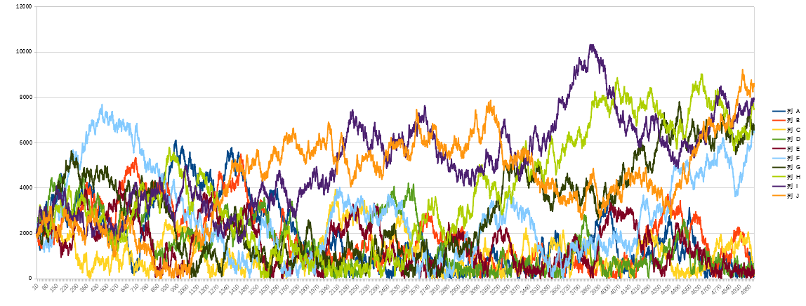

# 红包的收支平衡

过年在微x群里发新春红包, 经过一轮群内成员的分抢, 我的余额还多了(运气很好, 开门红的一年). 这导致我思考一个蛋疼的问题, 经过多轮的抢红包所有人的资金会有大多的差距? 就写了一个简单的代码模拟这个过程. 代码[random-money](https://github.com/zoroqi/rubbish/tree/master/random-money)

## 测试中主要变量
* 红包大小
    * 个人总余额固定百分比的钱进行发红包
    * 固定额度发红包, 不足全部发出
* 没回是否有特殊资金来源
    * 有每回合会得到一定的新的资金
    * 没有新的资金来源

## 测试

基准条件:
1. 人数100人
2. 进行10000轮抢红包(余额变动测试以5000轮为准)
3. 初始金额2000元
4. 额外收入2元
5. 红包占余额的比例10%
6. 固定额度200
7. 余额变动只输出结束时最多5人和最少的5人

> 无收入固定比例红包

经过多次测试, 余额最少用户和最多用户比值在0.549

余额变动

整体还好, 永续游戏的画每个人的实际余额是相同的. 所以作为玩玩的话这是最好的方案. 不会有人太多也不会有人太少. 大家可以乐呵乐呵.

> 无收入固定额度红包

经过多次测试, 余额最少用户和最多用户比值在0.008

余额变动

这个就比较惨了, 最少和最多人相差巨大, 但永续玩下去的话就是中国俗话"三十年河东三十年河西"总有转运的时候. 这个就不建议了, 没有永续的游戏, 总有人赔的太多.

> 有收入固定比例红包

经过多次测试, 余额最少用户和最多用户比值在0.515

余额变动

这个整体能就那样, 随着时间的变化总金额变多, 但每个人余额也都跟着水涨船高, 但每个人均匀的向上, 整体也还可以.

> 有收入固定额度红包

经过多次测试, 余额最少用户和最多用户比值在0.056

余额变动

这个比较残忍, 渐渐输的人再也无法翻身, 只能在下边进行小范围反复, 太想这个社会了.

## 简单的结论

我过年的红包策略更倾向于无收入固定比例红包, 大家玩玩还可以.

在一个零和游戏, 又完全靠脸, 所有人的机会是均等的. 在一个简单的摇骰子游戏下选择"固定比例下注"这是最好的策略, 大家可以玩的比较好, 输的人不会太多, 赢的人也不是太多大家相对和谐, 更多在玩游戏上.

而这个社会更像"有收入有的比例有上限红包"模式, 这个模式没测试, 之后看看咋做感觉需要使用到双曲线函数, 需要补补数学. 每个人都随着社会而富有. 但个人资产会不断积累导致贫富差距变大, 这种几乎是不可逆的(可逆需要一个多大的打击啊!)

个人投资上需要及时止损, 这很重要. 投资比例要控制在固定的范围内, 可以进行不断的追加和赎回. 只要社会在进步一定会更有钱, 是不是一定是最有钱这个没法保证, 但不至于被社会甩开.

我认为人类社会是一个零和游戏, 有人多了就有人少, 只是社会资源总量在急速增高导致所有人都在变多, 只是占有多的人增长更快. 所有有钱人更多上是社会进步的中大的获益者, 大概率和自身的努力没啥关系. 社会增长总有停止的时候, 之后就开始丛林社会了.

这个挺好玩, 有时间找找有没有开源人类学或人类行为学研究的程序, 模拟人类各种行为定制规则看看那种决策是最好的.

## 关键词

, #红包 #分配 #运气 #公平分配 #随记
