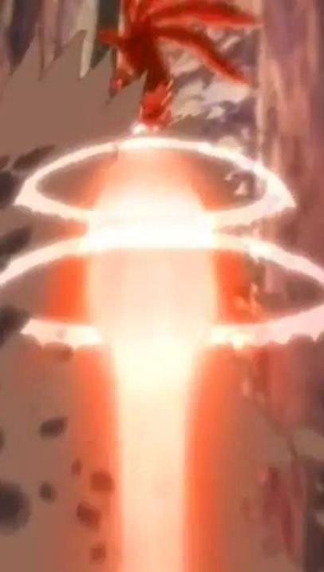

# 20210801

感觉自己在出差或旅游. 可能是准备离开这个城市, 坐在出租车上, 几分钟后出租车司机竟然搞起了拼车, 然后这个车上就从我和司机两人变成, 前三后三的六个人, 不知道怎么做的.

在一条笔直路上飞驰, 路的延长线末端是某个山脉. 突然天气骤变, 可能开始下暴雨, 我在考虑还能不能离开城市, 因为可能会有影响飞机或火车. 坐在前排的我, 眼看着几秒钟时间, 山脉上空的云瞬间聚合成一点\(成螺旋状向中间汇聚\), 在云大下端出现一个光球, 直接冲击地面, 而且在云端还有四到五层的光环, 这种冲击连续了三次.

然后我就醒了.

天气现象给我的感觉是这样的. 

, #灾害 #雷电 #梦 #冲击波 #天气 #自然灾害
